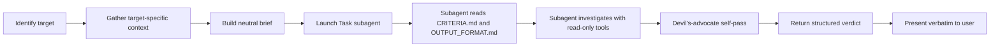

# review-task

A Cursor skill for **independent, unbiased review** of completed work — code, PRs, diffs, files, whole projects, specs, or configs — using a clean-context subagent so the implementing agent's bias never leaks into the verdict.

## Why

The agent that did the work cannot reliably audit it. Same-context "please review what we just built" produces motivated-reasoning reviews: the model has already invested in the implementation and tends to defend it. This is the [checkbox theater](https://dev.to/wordcaster/checkbox-theater-how-i-stopped-trusting-my-ai-agent-to-run-the-checks-2gf1) problem.

This skill solves it by delegating the review to a **fresh subagent** via Cursor's Task tool. The subagent has no implementation history, no prior justifications, and no anchoring bias. The parent agent's only job is to identify the review target, gather a comprehensive neutral context package, and pass it through.

## What It Reviews

| Target | Example trigger |
|---|---|
| `agent-changes` (default) | "review what you just did" |
| `diff` | "review HEAD vs main", "review last 3 commits" |
| `pr` | "review PR #482", a GitHub PR URL |
| `files` | "review src/auth/", "review these files: a.ts, b.ts" |
| `project` | "audit this codebase", "project health review" |
| `spec` | "review this spec at docs/sso.md" |
| `config` | "review CI config", "review my Dockerfile" |

## How It Works



Key design choices:

- **13 review dimensions** tagged with applicable targets (e.g. `Spec Quality` only fires on `spec`, `Architecture` only on `project`/`files`) so a PR review doesn't inherit project-audit noise.
- **Evidence rule**: every finding must cite `file:line`, command output, or a diff hunk. No evidence → goes to `Unverified claims`.
- **Confidence scoring (0–100)**: borrowed from [Anthropic's official code-review plugin](https://github.com/anthropics/claude-plugins-official/blob/main/plugins/code-review/commands/code-review.md). Threshold ≥80 to surface as a finding; lower findings are reported separately with a missing-evidence note.
- **Devil's-advocate self-pass**: the subagent challenges every finding (KEEP / WEAKEN / DROP) and runs a gap pass even when zero issues were found.
- **Mechanical verdict**: APPROVE / APPROVE_WITH_CHANGES / REQUEST_CHANGES / BLOCK is derived from severity counts, not from a feeling.

## Install

### Cursor

```bash
git clone https://github.com/koldovsky/skill-review-task.git ~/.cursor/skills/review-task
```

That's it. Cursor auto-discovers skills in `~/.cursor/skills/`. The skill is `disable-model-invocation: true`, so it activates only when the user explicitly asks for a review.

### Claude Code

Symlink (or copy) into `~/.claude/skills/`:

```bash
git clone https://github.com/koldovsky/skill-review-task.git ~/.claude/skills/review-task
```

Then either:

- Update the path references in `SKILL.md` from `~/.cursor/skills/review-task/...` to `~/.claude/skills/review-task/...`, or
- Rely on the parent agent to substitute the absolute path when launching the subagent (the skill's prompt template explicitly accommodates this).

### Updating

```bash
cd ~/.cursor/skills/review-task && git pull
```

## Usage

Just ask in plain English:

- "review what you just did"
- "review PR #482"
- "audit this codebase"
- "review the spec at docs/sso.md"
- "review my Dockerfile"

The skill will identify the target, gather context, delegate to a fresh Task subagent, and present a structured verdict.

### Optional Modes

Modes are orthogonal to target type. State the mode in your request.

| Mode | Effect |
|---|---|
| `comprehensive` (default) | All applicable dimensions |
| `security-only` | Only the Security dimension |
| `completeness-only` | Only Completeness vs Requirements |
| `quick` | Skip the gap pass; only surface findings with confidence ≥ 90 |
| `architecture-only` | Architecture & Maintainability + Project Health (best for `project`) |

Example: *"review PR #482 in security-only mode"*

## Output Schema

The subagent emits a strict markdown structure (full schema in [OUTPUT_FORMAT.md](OUTPUT_FORMAT.md)):

```markdown
## Review target
<target type> — <one-line scope>

## Verdict
APPROVE | APPROVE_WITH_CHANGES | REQUEST_CHANGES | BLOCK

## Risk score
<1-10>

## Findings
### F1 — <title>
- Severity, Category, Confidence, Evidence, Why it matters, Recommended fix, DA verdict

## Unverified claims (confidence < 80)
## Gap pass (things I almost missed)
## Next steps
```

## Files

| File | Purpose |
|---|---|
| [SKILL.md](SKILL.md) | Entry point — parent-agent workflow, target identification, per-target context playbook, subagent prompt template |
| [CRITERIA.md](CRITERIA.md) | 13 review dimensions, target applicability matrix, severity rubric, confidence scoring, devil's-advocate pass |
| [OUTPUT_FORMAT.md](OUTPUT_FORMAT.md) | Rigid markdown schema for subagent output |

## Customizing

The skill is intentionally generic. To adapt it to your project's conventions, prefer **runtime customization** over forking:

- Maintain `AGENTS.md`, `.cursor/rules/`, or equivalent in your project. The subagent reads these and applies them as part of `Code Quality & Conventions`.
- Document your project's verification commands (`npm test`, `pnpm lint`, etc.) in your README or `AGENTS.md` — the parent agent picks them up automatically.

If you need project-specific dimensions, fork and extend [CRITERIA.md](CRITERIA.md). The dimension table at the top is the contract; add new rows and tag them with applicable targets.

## Design References

- [Agentic AI Code Review: From Confidently Wrong to Evidence-Based](https://platformtoolsmith.com/blog/agentic-ai-code-review/) — the agentic-loop + terminal-tool pattern
- [agent-review-orchestrator](https://github.com/chrisarmitt/agent-review-orchestrator) — devil's-advocate verification layer
- [Anthropic's code-review plugin](https://github.com/anthropics/claude-plugins-official/blob/main/plugins/code-review/commands/code-review.md) — confidence scoring rubric
- [Checkbox Theater](https://dev.to/wordcaster/checkbox-theater-how-i-stopped-trusting-my-ai-agent-to-run-the-checks-2gf1) — why same-context self-review fails

## License

MIT — see [LICENSE](LICENSE).
