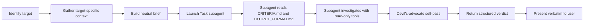

# Review Task

Independent verification of any reviewable target using a fresh subagent — eliminates bias from the implementing context, catches AI-specific failure modes (hallucinated imports, shallow tests, scope creep, missing security checks), and produces a structured, evidence-based verdict.

The parent agent (you) does NOT do the review. Your job is to identify the target, gather a comprehensive neutral context package, then delegate the review to a clean subagent that has not seen the implementation conversation.

> **Claude Code adaptation (this install).** Upstream is a Cursor skill; this copy is adapted for Claude Code. Concretely: disambiguation uses **`AskUserQuestion`** (not `AskQuestion`); the reviewer is launched with the **Task tool** using `subagent_type="general-purpose"` (or `"Explore"` for read-only targets); the criteria/output-format paths use a **`{SKILL_DIR}` placeholder** you substitute at launch (see Step 4). This skill is a *general-purpose* reviewer — for Vouch-specific PRD/FSD/DESIGN.md/honesty audits, prefer the project's own **`checker`** subagent; the two are complementary.

## When to Use

- After completing any non-trivial task (especially code, PRs, specs, migrations)
- When the user asks to verify, validate, audit, or review their work
- Before declaring "done" on tasks touching security, data, infra, billing, auth
- Before merging a PR — as a "second pair of eyes"
- For project-level audits: architecture, maturity, configuration health
- For spec/design-doc reviews

## When NOT to Use

- Trivial changes (typo, comment update, single-line tweak)
- The user wants you to *make a change*, not review one
- The user is mid-implementation and asks "is this on the right track?" — answer directly with your own context; do not spawn a subagent

## Review Targets

Identify the target before launching the subagent. If ambiguous, ask **one** disambiguation question via `AskUserQuestion`.

| Target | Trigger phrases | Default |
|---|---|---|
| `agent-changes` | "review what you just did", "review my task", "verify what we built" | yes (default if recent agent edits exist and target is unclear) |
| `diff` | "review this diff", "review HEAD vs main", "review last 3 commits", "review staged changes" | — |
| `pr` | "review PR #N", "review this pull request", a GitHub PR URL | — |
| `files` | "review src/auth/", "review these files: a.ts, b.ts", "review this module" | — |
| `project` | "review the whole project", "audit this codebase", "project health review" | — |
| `spec` | "review this spec", "review the design doc", "review the requirements" | — |
| `config` | "review CI config", "review my Dockerfile", "review the eslint config" | — |

## Workflow



### Step 1: Identify the target

Match the user's request against the target table. If ambiguous, ask one `AskUserQuestion` with the candidate targets as options. Do not guess — a wrong target wastes the entire review.

### Step 2: Gather target-specific context

Use these concrete commands. Capture outputs as artifacts to embed in the brief.

- **`agent-changes`**: list files you (the agent) touched in this session. If a git repo, run `git status --porcelain` and `git diff --stat` against the base branch. Recall the original task verbatim — do not rephrase or editorialize.
- **`diff`**: resolve the diff range from the user. Run `git diff <range>` and `git log --oneline <range>`. If `<range>` is missing, ask.
- **`pr`**: `gh pr view <num> --json title,body,headRefName,baseRefName,files` and `gh pr diff <num>`. Capture linked issue if present.
- **`files`**: list paths. For directories, expand recursively with `ls -R` or equivalent. Do not read every file — the subagent will Read/Grep on demand.
- **`project`**: collect repo skeleton (`ls -la`, top-level dirs only), `AGENTS.md`, `CLAUDE.md`, `README.md`, package manifests (`package.json`, `pyproject.toml`, etc.), CI configs (`.github/workflows/`), lint configs, test runner configs. Do NOT read source files exhaustively.
- **`spec`**: read the spec file(s). Identify references to code/artifacts inside. Note acceptance criteria and non-goals.
- **`config`**: read the specific config file(s) and any related project rule docs.

In **all cases** also collect:

- `AGENTS.md`, `CLAUDE.md`, `.cursor/rules/` paths if they exist
- **This repo (Vouch):** also surface `docs/current-state.md` (live handoff/plan), `docs/cv-agent-requirements.md` (PRD — findings should cite `FR-*`/`NFR-*`/`TC-*`/`BC-*` IDs), `docs/system-design.md` (FSD layering), `docs/DESIGN.md` (brand rules), and any `openspec/specs/*` or `openspec/changes/*` relevant to the target
- Project security/style docs if discoverable
- Verification commands (test/lint/typecheck) discovered from `package.json` scripts, `Makefile`, or CI config. **This repo:** `yarn build`, `yarn lint`, `yarn test`, and `openspec validate <change>` / `openspec validate --specs` when the OpenSpec CLI is available

If any required context is missing (no clear task description, no diff range, no PR number), ask the user **one** focused question before launching the subagent.

### Step 3: Build a neutral brief

The brief is the only context the subagent will see for this conversation. It must be self-contained.

**Required sections:**

1. **Target type** — one of the 7 from the table above
2. **Scope summary** — one line stating what is being reviewed
3. **Original requirement / spec** — verbatim where possible; otherwise a neutral summary. For `project` audits, the user's stated focus areas (or "general health" if unspecified)
4. **Acceptance criteria / scope / non-goals** — explicit, if any exist
5. **Deliverable inventory** — file paths, branch/commit refs, PR number, diff range
6. **Project context paths** — `AGENTS.md`, `CLAUDE.md`, `docs/current-state.md`, PRD/design/DESIGN docs, conventions, tech stack
7. **Verification commands** — exact commands the subagent can run
8. **Mode** — default `comprehensive`; alternatives below
9. **Severity preference** — default critical/warning/suggestion; user may override

**Anti-bias rules — DO NOT include in the brief:**

- Your own justifications for why the work is correct ("I think this is fine but please confirm")
- Conversation history that contains implementation reasoning
- Leading framing ("the only concern is X" — let the subagent find concerns)
- Apologies, hedges, or guidance about what to be lenient on

A biased brief produces a biased review.

### Step 4: Launch the Task subagent

Use the **Task tool** with `subagent_type="general-purpose"` (or `subagent_type="Explore"` if the target is read-only — `project`, `spec`, `files`, `config`, `pr`, `diff`).

**Path substitution (Claude Code).** Before launching, replace every `{SKILL_DIR}` in the template below with this skill's absolute directory:

- Project install: `$CLAUDE_PROJECT_DIR/.claude/skills/review-task`
- User-global install: `~/.claude/skills/review-task` (expand `~` to an absolute path if the subagent's tools cannot)

Use this prompt template **verbatim** (after substituting `{SKILL_DIR}` and the bracketed sections):

```
You are an independent task reviewer. You have NOT seen the implementation conversation. Your job is to validate the deliverable against the target with no charity, no assumptions of correctness, no editorial framing.

## Step 1: Read the criteria and output format

Read these two files first, then follow them strictly:
- {SKILL_DIR}/CRITERIA.md
- {SKILL_DIR}/OUTPUT_FORMAT.md

## Step 2: Review brief

[Insert the full brief from Step 3 here]

## Step 3: Select applicable dimensions

The review target is: [target type]
Read the "Target -> applicable dimensions" table at the top of CRITERIA.md and select only the dimensions that apply to this target. Skip the rest.

## Step 4: Conduct the review

For each applicable dimension:
1. Investigate using Read, Grep, Glob, Bash (run tests/lint/typecheck if commands were provided in the brief)
2. Cite evidence (file:line, command output, or diff hunk) for every finding
3. Classify severity per the rubric in CRITERIA.md
4. Score confidence 0-100. Findings below 80 go to the "Unverified claims" section, not "Findings"
5. If you cannot verify a claim, mark it UNVERIFIED — do not guess

## Step 5: Devil's-advocate self-pass

Before finalizing:
- For every finding, challenge it: "is this a real problem, or am I pattern-matching on something that looks bad?" Mark KEEP / WEAKEN (lower severity by 1) / DROP with a one-line reason
- Re-scan the target once more for things you might have missed (gap pass) — even if you found zero issues

## Step 6: Submit structured output

Return ONLY the format defined in OUTPUT_FORMAT.md. No conversational preamble. No "I hope this helps". The output is the deliverable.
```

Pass the prompt to the Task tool. Wait for completion.

### Step 5: Present findings verbatim

Pass the subagent's structured output through to the user without softening. Specifically:

- Do NOT summarize away Critical findings
- Do NOT add "I think this is mostly fine" framing
- Do NOT silently drop findings you disagree with

If the user disputes a finding, do not auto-concede. Either:

1. Re-launch the subagent with the dispute as new evidence and ask for a re-review of that finding only, OR
2. Present both views and let the user decide

Highlight Critical findings prominently. Offer next steps: fix critical findings, dispute with evidence, or accept.

## Optional Modes

Modes are orthogonal to target type. Pass the chosen mode in the brief.

| Mode | Effect |
|---|---|
| `comprehensive` (default) | All applicable dimensions |
| `security-only` | Only the Security dimension |
| `completeness-only` | Only Completeness vs Requirements |
| `quick` | Skip the gap pass; only surface findings with confidence >= 90 |
| `architecture-only` | Only Architecture & Maintainability and Project Health (best for `project` target) |

## Anti-Patterns

- **Reviewing in the same context as the implementation** — defeats the entire point. Always use the Task tool, never review inline
- **Editorial framing in the brief** — leading the subagent toward your preferred verdict
- **Skipping evidence** — accepting findings or rebuttals without `file:line` citations
- **Treating the verdict as advisory** — if Critical findings exist with high confidence, the task is not done
- **Reviewing trivial changes** — wastes tokens and trains the user to ignore reviews
- **Reviewing without identifying the target** — the same review checklist applied to a spec and a PR produces nonsense; identify first
- **Reading every file in `project` audits** — the subagent has Grep/Read; let it pull what it needs

## See Also

- [CRITERIA.md](CRITERIA.md) — full review criteria across all dimensions, target applicability matrix, severity rubric, confidence scoring
- [OUTPUT_FORMAT.md](OUTPUT_FORMAT.md) — required structured output schema
- Project `checker` subagent (`.claude/agents/checker.md`) — Vouch-specific maker≠checker review against PRD IDs, FSD import rules, DESIGN.md, and NFRs
