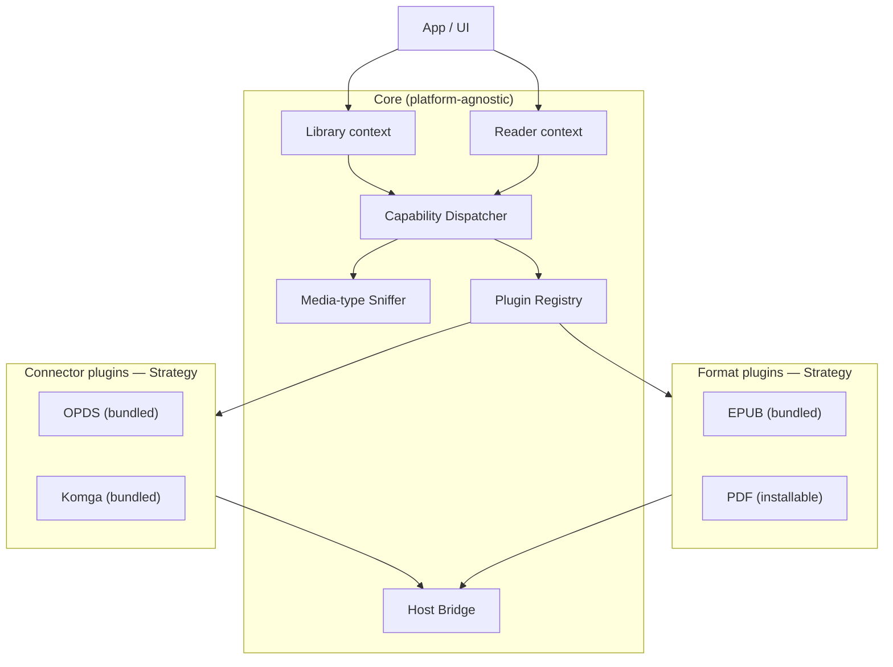
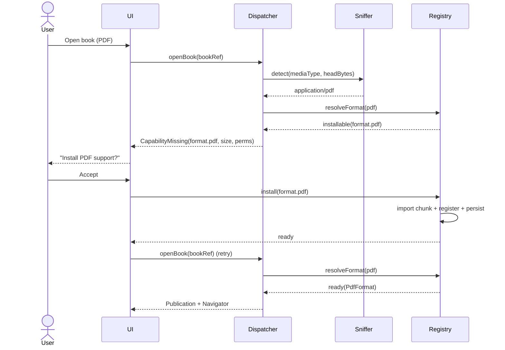
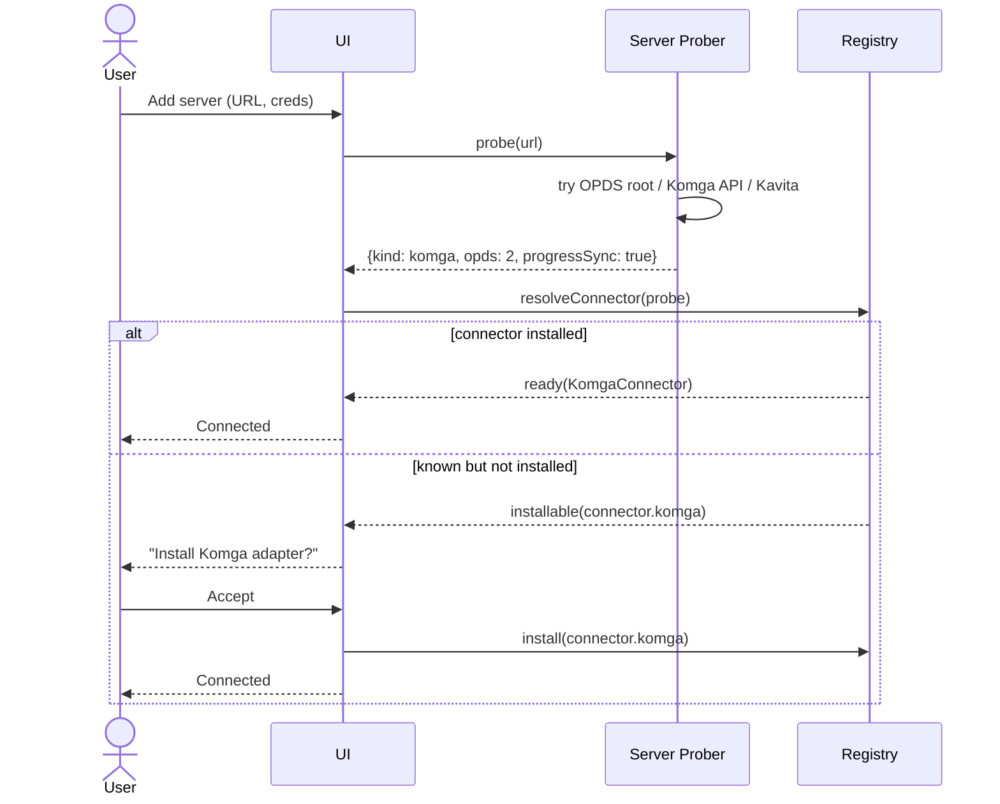

# DESIGN-CONNECTORS.md — Connectors & Formats

> **Renamed.** This file was `DESIGN.md` until the visual design system took that name (root
> `DESIGN.md` is now the token/typography/component spec). Archived OpenSpec changes under
> `openspec/changes/archive/` still cite it as `DESIGN.md`; those references are historical and
> point here. Section numbers are unchanged.

**Subsystem:** content sources (connectors) and book renderers (formats)
**Status:** draft v0.1
**Scope:** the pluggable layer that lets the app talk to a content source (OPDS / Komga) and open a publication (EPUB / PDF), plus the mechanism that detects a missing capability and offers to install it.

---

## 1. Goals & non-goals

### Goals
- **Two interchangeable strategies**, selected at runtime:
  - **Connector** — adapts an external content source (OPDS feed, Komga, later Kavita/Calibre) to one internal interface.
  - **Format** — parses a publication and renders it (EPUB, then PDF, later CBZ/FB2).
- **Plugin-shaped**: every connector and format is a self-describing plugin with a manifest and capabilities. The host doesn't hardcode which ones exist.
- **On-demand capability install**: when the app meets a resource it can't handle (e.g. a PDF when only EPUB is installed, or a server type whose adapter isn't installed), it resolves a suggested plugin and prompts the user to install it, then retries.
- **Web-first, portable**: the contract is platform-agnostic so the same plugins run in the PWA today and inside the Capacitor/Android shell later. The only thing that changes per platform is the HTTP client behind the host bridge (browser `fetch` vs native HTTP — which also sidesteps CORS on mobile).
- **Stateless plugins**: connectors and formats map requests/bytes; they do **not** own caching, the offline outbox, or sync. Those live in core and call into plugins through capability-gated methods.

### Non-goals (for now)
- Hosting any library content ourselves.
- Executing arbitrary **third-party** remote plugin code in v1 (see §11 — the contract is built so this can be added safely later, but the first plugins are first-party, code-split modules).
- Cross-source unified progress. Progress is owned per-origin by the user's own server (Komga/Kavita). A relay for no-progress-API sources is a separate, later concern.

---

## 2. Design patterns in play

| Pattern | Where | Why |
|---|---|---|
| **Strategy** | `Connector`, `FormatHandler` interfaces | interchangeable algorithms chosen at runtime |
| **Adapter** | each concrete connector | wraps a foreign API (OPDS, Komga REST) into our interface |
| **Registry / Service Locator** | `PluginRegistry` | discovery + selection of installed/available plugins |
| **Factory** | plugin `loader` | lazy instantiation via dynamic `import()` |
| **Composition over inheritance** | `KomgaConnector` reuses shared OPDS utilities | avoids a brittle inheritance chain |
| **Observer** | `CapabilityMissing` events | decouples detection from the install UI |

---

## 3. Architectural overview



- **Library context** uses a `Connector` to browse/download.
- **Reader context** uses a `FormatHandler` to open and render a publication.
- **Dispatcher** resolves which plugin to use; **Registry** holds installed + available plugins; **Sniffer** identifies media types; **Host Bridge** is the only surface plugins are allowed to touch.

---

## 4. Core domain model (shared vocabulary)

We normalise everything onto a **Readium-aligned Publication + Locator** model, so progress, TOC, bookmarks, and search work the same regardless of format.

```ts
// A position inside a publication. This is also the unit the sync engine stores.
interface Locator {
  href: string;                 // resource within the publication
  type?: string;                // media type of that resource
  title?: string;
  locations: {
    progression?: number;       // 0..1 within the resource
    totalProgression?: number;  // 0..1 within the whole publication
    position?: number;          // 1-based page-like index
    fragments?: string[];       // EPUB CFI, or PDF "page=/coords", etc.
  };
}

// Normalised publication produced by a FormatHandler.
interface Publication {
  metadata: { title: string; authors?: string[]; language?: string; /* ... */ };
  readingOrder: ResourceLink[]; // spine
  resources: ResourceLink[];    // images, css, fonts...
  toc: TocItem[];
  layout: 'reflowable' | 'fixed' | 'image-sequence' | 'mixed';
}

interface ResourceLink { href: string; type: string; title?: string; }

// Lightweight reference returned by browse/search, before the file is opened.
interface BookRef {
  sourceId: string;             // which connector instance it came from
  bookId: string;               // id within that source
  title: string;
  mediaType?: string;           // from connector metadata if known
  thumbnailHref?: string;
}
```

> **Why this matters:** because the same title in EPUB vs PDF yields different locators, **progress is keyed per `(sourceId, bookId, mediaType)`**, not per title. A user reading the EPUB on one device and the PDF on another has two legitimate, separate positions.

---

## 5. Strategy interfaces

### 5.1 Connector (content source)

```ts
interface Connector {
  readonly id: string;                       // "connector.komga"
  readonly capabilities: ConnectorCapabilities;

  // lifecycle
  probe(url: string, host: HostBridge): Promise<ProbeResult>;        // is this my kind of server?
  connect(config: ConnectorConfig, host: HostBridge): Promise<Session>;

  // browse
  listShelves(s: Session, paging?: Paging): Promise<Page<Shelf>>;    // libraries / series / collections
  listBooks(s: Session, q: BrowseQuery): Promise<Page<BookRef>>;
  search(s: Session, term: string, paging?: Paging): Promise<Page<BookRef>>;
  getBook(s: Session, bookId: string): Promise<BookMeta>;

  // content
  openResource(s: Session, bookId: string, href: string, range?: ByteRange): Promise<ResourceResponse>; // stream
  downloadBook(s: Session, bookId: string, opts?: DownloadOpts): Promise<ReadableStream | Blob>;          // offline

  // progress — OPTIONAL, gated by capabilities.progressSync
  getProgress?(s: Session, bookId: string): Promise<Locator | null>;
  setProgress?(s: Session, bookId: string, locator: Locator): Promise<void>;
}

interface ConnectorCapabilities {
  protocols: Array<'opds1' | 'opds2' | 'komga-rest' | 'kavita-rest'>;
  auth: Array<'none' | 'basic' | 'bearer' | 'apiKey' | 'oauth2'>;
  progressSync: boolean;        // server stores read progress (OPDS v2 progression, Komga/Kavita REST)
  search: boolean;
  download: boolean;
  pagedStreaming: boolean;      // per-page image streaming (e.g. Komga PSE) for comics
  thumbnails: boolean;
}
```

The sync engine, not the connector, decides *when* to call `setProgress` (on reconnect, draining the outbox) and applies the **furthest-progression-wins** policy by reading `getProgress` before writing. Connectors stay stateless.

### 5.2 Format (renderer)

**Governing principle:** the only platform-specific members of the rendering surface are (a) the navigator *factory* and (b) its *mount-target type*. Everything on the neutral `FormatHandler` and `Navigator` is conformance-testable by the future native client and carries no DOM.

#### Neutral contract (`core/contracts`)

```ts
// Random-access byte source a FormatHandler opens. A ZIP’s central directory is at the END of the
// archive, so the format reader needs read(offset, length), not a forward stream. OPFS-backed files
// and fully-buffered Uint8Arrays are both valid sources. No DOM/web type — the native client
// re-expresses this shape identically.
interface PublicationSource {
  size(): Promise<number>;
  read(offset: number, length: number): Promise<Uint8Array>;
}

interface FormatHandler {
  readonly id: string;                       // "format.epub"
  readonly mediaTypes: readonly MediaType[];
  readonly capabilities: FormatCapabilities;

  sniff(input: SniffInput): number;          // 0..1 confidence; mediaType / extension / head bytes
  open(source: PublicationSource): Promise<Publication>;
}

interface FormatCapabilities {
  mediaTypes: readonly MediaType[];     // ["application/epub+zip"]
  extensions?: readonly string[];       // ["epub"]
  layout?: ‘reflowable’ | ‘fixed’ | ‘image-sequence’ | ‘mixed’;
  search?: boolean;
  tts?: boolean;
  locatorScheme?: ‘cfi’ | ‘page’ | ‘position’ | ‘href-progression’;
}

// The renderer instance. Every member here is DOM-free — the same verbs the native reader needs.
// The renderer owns pagination (it knows where the next reflowable page boundary is), so
// next/prev/seek are navigator methods, not reader-computed goTos.
interface Navigator {
  goTo(locator: Locator): Promise<void>;
  next(): Promise<void>;                     // turn to the next page/spread
  prev(): Promise<void>;                     // turn to the previous page/spread
  seek(fraction: number): Promise<void>;     // 0..1 total-progression jump (position-bar scrubber)
  currentLocator(): Locator;
  applyPreferences(preferences: ReadingPreferences): void;   // font, size, theme, columns, RTL...
  on(event: ‘locatorChanged’, callback: (locator: Locator) => void): Unsubscribe;
  on(event: ‘error’, callback: (error: unknown) => void): Unsubscribe;
  destroy(): void;
}

// Neutral in-memory PublicationSource helper (no web types) for full-buffer callers and tests.
function publicationSourceFromBytes(bytes: Uint8Array): PublicationSource;
```

`NavigatorOptions` (`{ source: PublicationSource; preferences?: ReadingPreferences }`) is also neutral — the mount target is a parameter of the platform-specific factory below, never here.

#### Web extension (`platform/web`)

The ONLY web-bound members of the rendering surface live in `src/platform/web/web-format-handler.ts`:

```ts
// Extends the neutral Navigator with pageCount() — a viewport-dependent page-total estimate
// that cannot be conformance-matched across platforms. Web-only.
interface WebNavigator extends Navigator {
  pageCount(): number | undefined;           // undefined before layout completes
}

// Extends the neutral FormatHandler with the one DOM-bound member: the navigator factory.
interface WebFormatHandler extends FormatHandler {
  createNavigator(
    publication: Publication,
    mount: HTMLElement,                      // the single DOM type in the whole surface
    options: NavigatorOptions,
  ): Promise<WebNavigator>;
}

// Structural type guard — checks typeof createNavigator, not instanceof, so a future
// sandbox-proxied handler still passes.
function isWebFormatHandler(handler: FormatHandler): handler is WebFormatHandler;
```

Web source builders (`publicationSourceFromFile(file: File)` and `publicationSourceFromStream(stream)`) also live in `platform/web` because they carry the `File`/`ReadableStream` web types.

Initial-render completion is signalled by the resolution of the `createNavigator` promise — there is NO `loaded` event. Post-load faults (errors that fire after the promise settles) arrive on the `’error’` event subscription.

**EPUB rendering isolation (ADR-013, active):** `WebFormatHandler.createNavigator` does not mount foliate into `mount` directly. Instead it embeds a cross-origin `<iframe>` (served from `VITE_READER_ORIGIN`, a separate port or subdomain) and returns a **navigator proxy** that implements the `WebNavigator` interface by forwarding calls over a `MessageChannel` bridge. The full foliate `View` and all spine `<iframe>` documents live on the reader origin; the app origin only holds the proxy. The proxy is `markRaw()`’d (ADR-001) because it holds the iframe and `MessagePort`s in closure variables — Vue reactivity must never wrap them. Book bytes cross once as a Transferable `ArrayBuffer` (ADR-005). The bridge carries **no window `message` listener** on the app side — events arrive solely over the handed capability `MessagePort` so a book script (same-origin to the reader origin) cannot forge them. See `src/platform/web/reader-frame/` (the in-frame harness, protocol, and CSS) and `src/plugins/formats/epub/navigator-proxy.ts` (the app-side proxy).

---

## 6. The plugin system

### 6.1 Manifest

Every plugin is described by a manifest. Bundled plugins ship in the app build; the `loader` is a code-split dynamic import. Remote plugins (future) add a `source` URL and signature.

```ts
type PluginKind = 'connector' | 'format';

interface PluginManifest {
  id: string;                   // "format.pdf"
  name: string;                 // "PDF support"
  version: string;              // semver of the plugin
  kind: PluginKind;
  hostApi: string;              // semver RANGE of host API it targets, e.g. "^1.0.0"
  bundled: boolean;
  source?: string;              // remote module URL (future)
  integrity?: string;          // SRI hash for remote modules (future)
  permissions?: PluginPermissions;
  capabilities: ConnectorCapabilities | FormatCapabilities;
  approxSizeKB?: number;        // shown in the install prompt
}

interface PluginPermissions {
  network?: string[] | '*';     // allowed origins, enforced by HostBridge.http
  storageQuotaMB?: number;
}

// The runtime module a loader resolves to.
interface PluginModule {
  manifest: PluginManifest;
  create(): Connector | FormatHandler;
}
```

### 6.2 Registry & resolution

```ts
interface PluginRegistry {
  installed(kind?: PluginKind): PluginManifest[];
  available(kind?: PluginKind): PluginManifest[];   // catalog of installable plugins

  install(id: string): Promise<void>;               // load chunk -> register -> persist
  enable(id: string): void;
  disable(id: string): void;

  resolveConnector(probe: ProbeResult): Resolution<Connector>;
  resolveFormat(sniff: SniffInput): Resolution<FormatHandler>;
}

type Resolution<T> =
  | { status: 'ready'; instance: T }                       // installed & enabled
  | { status: 'installable'; suggestion: PluginManifest }  // known but not installed
  | { status: 'unsupported' };                             // nothing matches anywhere
```

- **Installed set is persisted** (IndexedDB / settings). On startup the registry hydrates it; the actual plugin chunk is lazy-loaded on first use, not at boot, to keep the initial bundle small (Readium + EPUB is heavy).
- `available()` is a static catalog in v1 (first-party plugins). It becomes a fetched remote index when third-party plugins land.

### 6.3 Host Bridge (the plugin contract)

Plugins never import app internals. They receive a `HostBridge` — the **only** surface they may touch. This keeps them decoupled and is the seam that makes future sandboxing possible.

```ts
interface HostBridge {
  http: HttpClient;        // platform-swappable: fetch (web) or native HTTP (Capacitor). Enforces permissions.network
  storage: ScopedStorage;  // namespaced to the plugin id; no access to other plugins' data
  logger: Logger;
  events: EventBus;
  mediaType: MediaTypeUtils;
  locator: LocatorUtils;
}
```

The single most important consequence: **CORS and mixed-content are a host concern, not a plugin concern.** On web, `http` is `fetch` (and the user must allowlist the app origin in their Komga `KOMGA_CORS_ALLOWED_ORIGINS`); on Android the same plugin runs unchanged over a native HTTP client with no CORS. Plugins are written once.

### 6.4 Loading (PWA today, remote later)

- **Bundled / first-party:** `loader = () => import('./plugins/formats/pdf')`. "Install" flips enabled, dynamic-imports the chunk, registers the instance, persists the choice. No new code is downloaded from third parties.
- **Remote / third-party (future):** fetch module from `manifest.source`, verify `integrity`, cache it, then run it **inside a Worker or sandboxed iframe** with only the `HostBridge` exposed via `postMessage`. See §11.

---

## 7. Media-type sniffing

Resolution is only as good as type detection. The sniffer tries sources in priority order and returns a best match with confidence:

1. **Connector-supplied metadata** — OPDS `<link type=...>` / Komga `media.mediaType` (most reliable).
2. **HTTP `Content-Type`** on the resource response.
3. **File extension**.
4. **Magic bytes** — `%PDF` for PDF, `PK\x03\x04` (+ `mimetype` entry) for EPUB, etc.

```ts
interface SniffInput { mediaType?: string; extension?: string; headBytes?: Uint8Array; }
type MatchConfidence = number; // 0..1; dispatcher picks the highest across installed formats
```

---

## 8. Resolution & "suggest install" flows

### 8.1 Open a book whose format isn't installed (the PDF case)



If resolution returns `unsupported`, the UI degrades gracefully: offer the raw file download and a clear "format not supported" message.

### 8.2 Add a server whose connector isn't installed



The prober is generic: it asks each **installed** connector to `probe(url)` (return confidence), and if none match, checks the **available** catalog. A bare OPDS server that no specialised connector claims still works via the generic OPDS connector — the always-available fallback.

---

## 9. Default bundle & roadmap

### Bundled by default
| Plugin | Kind | Notes |
|---|---|---|
| `connector.opds` | connector | generic OPDS 1/2 base; always-available fallback; progress via OPDS v2 progression *if the server advertises it* |
| `connector.komga` | connector | richer Komga REST: search, page-streaming, read-progress write-back, thumbnails |
| `format.epub` | format | reflowable, search, TTS, CFI locators |

### Installable (suggested on demand)
| Plugin | Kind | Triggers / notes |
|---|---|---|
| `format.pdf` | format | **next up**; suggested the first time a PDF is opened |
| `connector.kavita` | connector | Kavita REST + KOReader sync |
| `connector.calibre` | connector | OPDS only; **no progress API** → progress stays local (or needs the optional relay) |
| `format.cbz` | format | image-sequence (manga/ranobe scans), RTL, double-page |
| `format.fb2` | format | reflowable; common in the ranobe/RU ecosystem |
| `format.mobi` | format | likely **convert-on-import to EPUB** rather than a native renderer |

---

## 10. Komga vs OPDS: composition, not inheritance

Komga *is* OPDS-capable, so `connector.opds` can already browse, download, and (via OPDS v2) sync progress against a Komga server. `connector.komga` exists because the **REST API is richer**: better paging and search, on-deck / keep-reading feeds, per-page image streaming for comics, and direct read-progress endpoints.

Rather than `KomgaConnector extends OpdsConnector`, share an `opdsCore` utility module (feed parsing, acquisition-link resolution, progression mapping) and have `KomgaConnector` **compose** it, overriding only where REST is better. This avoids an inheritance chain that future connectors would fight against.

---

## 11. Security & sandboxing

### 11.1 EPUB renderer origin isolation (ADR-013, active)

Untrusted EPUB content already runs on a **separate browser origin** — not as a future aspiration but as the
current, shipped rendering mechanism. The foliate engine is served from a configurable reader origin
(`VITE_READER_ORIGIN`, dev/e2e: `:5174`), embedded as a cross-origin `<iframe>` with **no `sandbox`
attribute** (the cross-origin URL is the isolation; an opaque sandbox breaks foliate's synchronous
`contentDocument` access to its own spine iframes). See §5.2 and ADR-013 in `stack.md`.

Key security properties of the active design:
- A book script running in-frame is same-origin to the reader origin, cross-origin to the app → `window.top.localStorage` throws `SecurityError` by the browser's same-origin policy, not by any in-app sanitizer.
- The bridge is **port-capability only**: the app posts the init handshake with `targetOrigin = READER_ORIGIN` (never `*`) and thereafter listens for events **only over the capability `MessagePort`**. There is no window `message` listener on the app side, removing the spoof seam a book script could otherwise exploit (a book script is same-origin to the reader origin and could `postMessage` forged events that an origin check on a window listener would accept).
- The reader origin is fail-closed: if `VITE_READER_ORIGIN` is unset or equals the app origin, the proxy throws and renders nothing — there is no same-origin fallback.
- Book bytes cross as a zero-copy Transferable `ArrayBuffer` (ADR-005); credentials never cross.

### 11.2 Third-party plugin sandboxing (future)

First-party plugins are trusted code in our own build. The moment we allow **remote** plugins, running their code in the page would be a critical risk. The contract is already shaped to contain this:

- Plugins only ever receive the `HostBridge` — no `window`, no direct DOM, no other plugin's storage.
- `HostBridge.http` enforces `permissions.network`; a plugin can't reach origins it didn't declare.
- `HostBridge.storage` is namespaced per plugin id.
- Remote modules require an `integrity` (SRI) hash and are pinned + cached.
- Execution target for untrusted plugins: a **Worker** (for connectors/parsers, no DOM needed) or a **separate-origin iframe** (`postMessage` bridge) for anything that must render. The EPUB renderer's separate-origin design (§11.1) is the template for this.

Until that exists, `available()` lists only first-party plugins, and `install` only ever dynamic-imports our own chunks.

### 11.3 PDF renderer — intentional in-app canvas (active, asymmetric to EPUB)

`format.pdf` renders pages to an in-app `<canvas>` element, not in a cross-origin iframe. This is a
deliberate, coherent asymmetry:

- **EPUB** executes *book-authored HTML and JavaScript*, so it must run on the reader origin where the
  browser's same-origin policy isolates it from the app's `localStorage`/credentials (§11.1).
- **PDF** rasterizes *pixels* — pdfjs's `pdfPage.render({canvas})` produces a bitmap; no book-authored
  script runs in the page. The untrusted surface is byte content reaching the pdfjs engine, not script
  execution.

The defense-in-depth that substitutes for origin isolation:
- `isEvalSupported: false` — prevents pdfjs's eval-based fast paths from processing untrusted document
  bytes (CVE-2024-4367 class).
- `enableScripting: false` — keeps the PDF's own OpenAction/field scripts inert.
- No `cMapUrl` / `standardFontDataUrl` network config — the engine fetches no external resources.
- Bytes arrive via `SourceRangeTransport` wired to `PublicationSource.read` (ADR-005); the full file is
  never buffered.

If pdfjs ever gains a text/annotation layer that executes untrusted content, re-evaluate whether an
isolated Worker or sandboxed iframe is warranted.

---

## 12. Versioning & compatibility

- The host exposes `HOST_API_VERSION` (semver). Each manifest declares a compatible `hostApi` range; the registry refuses to load a plugin outside it, with a clear message.
- The `HostBridge` shape is the public API contract — additive changes are minor versions; any removal/rename is a major. Keep it small on purpose.

---

## 13. Suggested directory layout

```
src/
  core/
    model/            # Locator, Publication, BookRef, MediaType
    registry/         # PluginRegistry, resolution
    dispatch/         # Capability Dispatcher, Server Prober
    sniff/            # Media-type sniffer
    bridge/           # HostBridge impl, HttpClient (web), ScopedStorage
    contracts/        # Connector, FormatHandler, Navigator, manifests (no impls)
  plugins/
    connectors/
      opds/           # manifest + impl (composes opds-core)
      komga/
      _opds-core/     # shared OPDS utilities
    formats/
      epub/           # manifest + impl (Readium EPUB navigator binding)
      pdf/            # installable
  platform/
    web/              # fetch-based HttpClient, OPFS storage
    capacitor/        # native HTTP + filesystem (added later, same contracts)
  app/                # UI, wiring, install prompts
```

`core/contracts` holds interfaces only; everything in `plugins/` depends on contracts, never the other way around.

---

## 14. How to add a new connector or format

**New format** (e.g. CBZ):
1. Implement `FormatHandler` in `plugins/formats/cbz/` (sniff, open → `Publication`, `createNavigator`).
2. Write its `PluginManifest` (media types, extensions, signatures, layout, locator scheme).
3. Register a `loader` (`() => import('./plugins/formats/cbz')`) in the available catalog.
4. Nothing else changes — the dispatcher resolves it the next time a CBZ is opened and offers to install it.

**New connector** (e.g. Kavita):
1. Implement `Connector` in `plugins/connectors/kavita/` (probe, browse, content, optional progress).
2. Reuse `_opds-core` where the server speaks OPDS.
3. Declare capabilities honestly (set `progressSync` only if the server really stores it).
4. Add manifest + loader to the catalog. The prober and registry pick it up.

---

## 15. Open questions / deferred decisions

- **Progress for no-progress-API sources** (Calibre, bare OPDS, sideloaded files): local-only per device, or route through an optional relay? Out of scope here; the connector simply reports `progressSync: false`.
- **Remote plugin distribution**: index format, signing, review. Deferred until after the first-party set is stable.
- **DOM-rendering sandbox**: can format renderers ever run untrusted? Likely the last thing to open up.
- **Conversion pipeline** (MOBI/AZW3 → EPUB, CBR → CBZ): a "format importer" sibling concept, or folded into format plugins?
- **Capacitor HTTP parity**: confirm streaming + range requests behave identically to browser `fetch` for large downloads.
