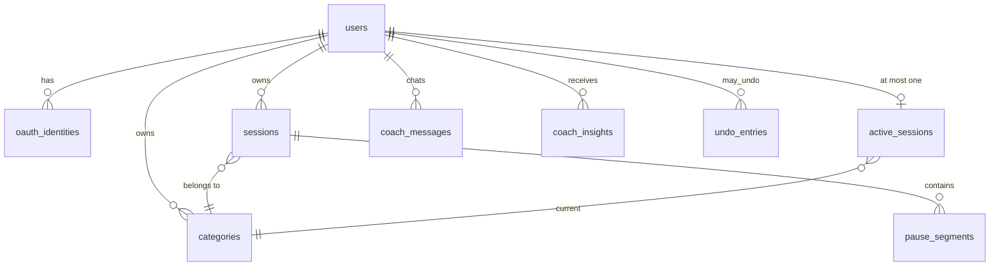

# Cadence — architecture (technical design)

> The technical/engineering design: architecture, data model, metric formulas, coach contract,
> live sync, and undo. Resolves every open item (O-1..O-9) and each `(...: architecture.md)` marker
> in [`docs/requirements.md`](requirements.md). Requirements say WHAT; this document says HOW.
> Visual / UI design lives separately in [`docs/DESIGN.md`](DESIGN.md).
> Format: significant choices use **Decision / Rationale / Alternatives / Serves** blocks so the
> owner can review and veto without re-deriving them. Status: DRAFT for owner ratification.
> ADR 0001 confirmed to match (FastAPI + async SQLAlchemy 2.0 + Alembic + PostgreSQL; React 18 +
> Vite + TS strict) — this document extends it, does not contradict it.

## Decisions that most need owner review

1. **Live sync = 5-second short polling**, not WebSocket/SSE (section 5). "Live" means <= ~6 s
   cross-device, not instant. If that latency is unacceptable, veto now — it is the cheapest
   decision to change on paper and the most expensive in code.
2. **Undo = immediate server write + compensating restore** (section 6), not delayed commit.
   Changes propagate to other devices right away; Undo performs a server-side restore.
3. **Midnight-spanning sessions: aggregation splits minutes across days; the session entity stays
   whole; a deep block is judged on the whole session and attributed to its start day** (section 3.7).
4. **OAuth auto-links by verified email match** — Google/GitHub sign-in with an email that matches
   an existing account links to it instead of creating a duplicate (section 8.3).
5. **Category delete = archive (soft-delete)** — history and metrics keep the category; pickers
   hide it (section 7).
6. **Grounding validator exempts bare small integers 0-9 without units** (e.g. "two options");
   all unit-bearing / decimal / percent / time numbers must exist in the snapshot (section 4.4).
7. **M2 Consistency counts zero days** in day-to-day regularity — a skipped day lowers the score
   (section 3.2).

---

## 1. Architecture overview

Four layers; dependency arrows point inward only.

```
frontend (React+Vite+TS+Tailwind)      extension (MV3 popup, same API)
        \\                                /
         backend/app/api (FastAPI routers, cookies, DTOs)
                     |
         backend/app/services (use-cases: timer, sessions, undo, coach, sync)
                     |
   +-----------------+---------------------+
   |                                       |
backend/app/core (PURE: metrics,        backend/app/repos (SQLAlchemy 2.0
snapshot builder, grounding validator,   async repositories, Alembic
zone/baseline math; no FastAPI, no       migrations, PostgreSQL)
SQLAlchemy, no I/O imports)
```

- **`app/core` is framework-free** (serves NFR-DET-01): pure functions over plain dataclasses
  (`SessionData`, `PauseData`). 100% unit-testable without a database. This is where all metric
  math (section 3), the snapshot builder, and the grounding validator (section 4.4) live.
- **`app/services`** orchestrates: loads rows via repos, maps to core dataclasses, calls core,
  persists results. Coach service also owns the LLM client and fallback logic.
- **`app/api`** is thin: request/response models (Pydantic), auth dependency, no business logic.
- **Frontend and extension are two clients of one API**; the extension has no logic of its own
  (FR-EXT-01, TC-EXT-01). All frontend HTTP goes through `src/api.ts` (TC-STACK-03).

**Decision:** metrics compute on read (per request), no precomputed aggregates.
**Rationale:** personal-scale data (thousands of sessions, not millions); pure recompute keeps a
single source of truth and makes NFR-PERF-01 trivially satisfiable; caching is premature.
**Alternatives:** nightly rollup tables (stale + more moving parts); materialized views (Postgres
coupling in core). **Serves:** NFR-DET-01, NFR-PERF-01. Budget for NFR-PERF-01: computing the full
snapshot for one user over a 30-day window completes in **< 500 ms** server-side at 10k sessions.

## 2. Data model

PostgreSQL via async SQLAlchemy 2.0; every schema change ships an Alembic migration (TC-STACK-01).
All tables carry `id BIGINT GENERATED ALWAYS AS IDENTITY PRIMARY KEY`, `created_at TIMESTAMPTZ NOT
NULL DEFAULT now()`. All timestamps are stored **UTC**; day attribution converts to the user's
timezone at read time (FR-METR-07, A-1).



### 2.1 Tables

**users** — `email CITEXT UNIQUE NOT NULL` · `password_hash TEXT NULL` (null for OAuth-only
accounts) · `timezone TEXT NOT NULL DEFAULT 'UTC'` (IANA name, browser-detected at login/refresh,
per A-1) · `coach_language TEXT NOT NULL DEFAULT 'en'` (`en|uk`, A-7).

**oauth_identities** — `user_id FK -> users ON DELETE CASCADE` · `provider TEXT NOT NULL`
(`google|github`) · `provider_user_id TEXT NOT NULL` · `email_at_link CITEXT` ·
`UNIQUE(provider, provider_user_id)`. Supports linking (section 8.3, O-6).

**categories** — `user_id FK` · `name TEXT NOT NULL` · `color TEXT NOT NULL` (hex) ·
`description TEXT NULL` · `archived_at TIMESTAMPTZ NULL` (section 7) ·
`UNIQUE(user_id, name) WHERE archived_at IS NULL`. Flat list, no nesting (FR-CAT-01).

**sessions** (saved sessions only) — `user_id FK` · `category_id FK -> categories` ·
`started_at TIMESTAMPTZ NOT NULL` · `ended_at TIMESTAMPTZ NOT NULL` · `notes TEXT NULL` ·
`source TEXT NOT NULL` (`timer|manual`) · CHECK `ended_at > started_at` ·
INDEX `(user_id, started_at)`. (FR-SESS-01)

**pause_segments** — `session_id FK -> sessions ON DELETE CASCADE` ·
`paused_at TIMESTAMPTZ NOT NULL` · `resumed_at TIMESTAMPTZ NOT NULL` · CHECK
`resumed_at > paused_at` · CHECK pause lies within its session. Manual sessions may carry manually
entered segments (A-6, FR-SESS-03/04).

**active_sessions** (the live timer; exactly the server-authoritative state of FR-TIMER-06) —
`user_id FK UNIQUE` (enforces "at most one") · `category_id FK` · `started_at TIMESTAMPTZ NOT NULL`
· `state TEXT NOT NULL` (`running|paused`) · `pause_started_at TIMESTAMPTZ NULL` (set while paused)
· `accumulated_pauses JSONB NOT NULL DEFAULT '[]'` (closed pause pairs) ·
`version INTEGER NOT NULL DEFAULT 1` (optimistic concurrency across devices).
On **stop+save**, a row in `sessions` + `pause_segments` is written atomically and the
`active_sessions` row is deleted. On **discard**, the row is deleted and its before-image goes to
`undo_entries` (section 6).

**Decision:** the active timer is its own table, not a `sessions` row with `ended_at NULL`.
**Rationale:** the uniqueness rule ("one active per user") becomes a DB constraint instead of
application code; saved-session queries never need to filter out unfinished rows; the
undo-of-discard story (restore an unsaved timer) stays clean. **Alternatives:** nullable
`ended_at` on `sessions` (leaks unfinished rows into every metric query); Redis-held timer state
(extra infra, violates BC-COST-01 spirit). **Serves:** FR-TIMER-06, FR-TIMER-04, O-9.

**coach_messages** — `user_id FK` · `role TEXT` (`user|coach`) · `content TEXT NOT NULL` ·
`language TEXT NOT NULL` · INDEX `(user_id, created_at)`. One rolling thread per user (v1).
(FR-COACH-03/04)

**coach_insights** — `user_id FK` · `week_start DATE NOT NULL` (user-TZ Monday) ·
`payload JSONB NOT NULL` (the structured card, section 4.2) · `UNIQUE(user_id, week_start)` —
cached "latest insight" for the drawer (FR-SHELL-02, FR-COACH-01).

**undo_entries** — `user_id FK` · `action TEXT` (`discard|edit|delete`) ·
`before_image JSONB NOT NULL` · `expires_at TIMESTAMPTZ NOT NULL` · `consumed_at TIMESTAMPTZ NULL`.
(Section 6, FR-NOTIF-01)

### 2.2 Durations

**Decision:** net and gross durations are **derived, never stored**.
`gross = ended_at - started_at`; `net = gross - SUM(pause segments)` (FR-SESS-02). Computed in
`app/core` for metrics and exposed by the API per session. **Rationale:** one source of truth;
editing a pause can never desynchronize a stored total. **Alternatives:** denormalized
`net_seconds` column (fast but corruptible). **Serves:** FR-SESS-02, NFR-DET-01.

## 3. Metric formulas (M1-M6) — resolves O-1, O-2, O-3

All metrics are pure functions in `app/core/metrics/` over `(sessions, pauses, timezone, today)`.
Every function returns well-defined zero/empty values on empty input (E-1). "Day" always means a
calendar day in the user's timezone (FR-METR-07). "Minutes" always means **net minutes**.

### 3.1 M1 Volume (FR-METR-01)
`today`, `this_week` (user-TZ Monday..now), `this_month`, `all_time`: sum of net minutes attributed
per section 3.7. `daily_avg_30d` = (net minutes over trailing 30 calendar days) / 30 (zero days
included in the denominator).

### 3.2 M2 Consistency Score 0-100 (FR-METR-02)
Window: trailing **14 calendar days** ending today.
- `regularity = clamp(1 - CV, 0, 1) * 100`, where `CV = stddev / mean` of the 14 daily net totals,
  **zero days included**. If `mean == 0`, regularity = 0.
- `start_stability = (active days whose first session start is within +/-60 min of the median
  first-start over active days in the window) / (active days) * 100`. Median start is computed as
  minutes-since-local-midnight.
- `M2 = round(0.5 * regularity + 0.5 * start_stability)`.
- Requires **>= 3 active days** in the window; below that M2 reports `null` with a low-confidence
  flag (section 3.8).

**Decision:** zero days count against regularity (a skipped day lowers CV-based regularity).
**Rationale:** the product's core promise is steady rhythm vs. guilt-driven bursts; excluding rest
days would let "one huge Saturday" score as consistent. Streaks (M5) already reward day coverage
separately, so the signal is not double-counted — it is the honest read. **Alternatives:** CV over
active days only (rewards bursts); Whoop-style 4-day window (too twitchy for work). **Serves:**
FR-METR-02.

### 3.3 M3 Focus / Deep Work (FR-METR-03)
Deep block = a saved session with `net >= 60 min` **and zero pause segments** (any pause
disqualifies — ratified; boundary is inclusive per E-5, and a single short pause disqualifies per
E-6). Outputs: `deep_count`, `deep_minutes`, and
`deep_share = deep_minutes / total_net_minutes` over the window (denominator resolved per O-1:
**total net tracked minutes in the same window**; 0 when the denominator is 0).

### 3.4 M4 Context Switching (FR-METR-04)
Per active day: `switches` = transitions between consecutive saved sessions (ordered by
`started_at`) whose categories differ; `interruptions` = count of pause segments across that day's
sessions; `switch_load = switches + interruptions`.
**Flag threshold (O-1):** a day is flagged fragmented when
`switch_load > max(3, 1.5 * baseline_mean_switch_load)` where the baseline mean is over the
trailing 30 days' active days. The `max(3, ...)` floor prevents flagging users whose baseline is
near zero.

### 3.5 M5 Streaks (FR-METR-05)
`current_streak`: consecutive active days ending today or yesterday (a not-yet-tracked today does
not break a live streak); `longest_streak`: max run over all history.

### 3.6 M6 Baseline deltas and zones (FR-METR-06)
For each score S in {M1 daily volume, M2, M3 deep_share, M4 switch_load, M5 current_streak}:
`baseline(S)` = the same score computed over the trailing 30 days ending **yesterday** (so today's
partial day never pollutes its own baseline). `delta = value - baseline`,
`rel = delta / baseline` (undefined when baseline = 0 -> zone `neutral`).
Each metric declares a direction: higher-better (M1, M2, M3, M5) or lower-better (M4).
**Zone thresholds (O-1):** after normalizing so that positive `rel` = improvement
(negate for lower-better): **green** `rel >= -0.05`; **yellow** `-0.20 <= rel < -0.05`;
**red** `rel < -0.20`. In words: at-or-near your baseline is green, 5-20% worse is yellow, more
than 20% worse is red.

### 3.7 Day attribution and midnight (FR-METR-07, O-2, E-3)
**Decision:** aggregation **splits a session's net minutes across the local days it spans**
(minute-accurate at local midnight, pauses subtracted from the day they occur in); the session
**entity is never split**; a midnight-spanning zero-pause session of >= 60 min **is one deep
block, attributed to its start day**; a day is *active* if it receives >= 1 attributed minute.
**Rationale:** split aggregation keeps daily totals and the heatmap truthful (23:00-02:00 work
visibly touches two days) — anything else distorts M1/M2; keeping the entity and the deep block
whole preserves the user's mental model ("that was one sitting"). **Alternatives:** assign all
minutes to the start day (simplest, but a night owl's Tuesday work inflates Monday); splitting the
deep block too (a 90-min sitting would vanish as two sub-60 halves — wrong). **Serves:**
FR-METR-07, FR-METR-03, E-3, E-4.

### 3.8 Sparse data (O-3, E-2, E-7)
Baselines use available history with a **minimum of 7 days**; with < 7 days of history, values are
shown but `delta = null`, `zone = "building"`, and the UI renders a neutral "building baseline —
day N of 30" badge instead of a color. M2 additionally requires >= 3 active days (3.2). Nothing
errors on empty or single-session input (E-1, E-2): sums are 0, shares are 0, streaks are 0/1,
zones are `building`.

### 3.9 Heatmap intensity (FR-HEAT-01, O-1)
5 levels, GitHub-style. Level 0 = 0 minutes. Levels 1-4 = quartiles of the user's **non-zero**
daily totals within the displayed period (p25/p50/p75 as cut points). Self-normalizing per user and
period; deterministic given the data.

## 4. Coach / LLM contract — resolves O-5, O-7

### 4.1 Snapshot schema (FR-COACH-04) — the closed set of numbers the coach may cite
Built by `app/core/snapshot.py` for the current week (user-TZ Monday 00:00 -> now):

```json
{
  "window": {"start": "2026-07-06", "end": "2026-07-09", "days": 4},
  "volume": {"today_min": 132, "week_min": 611, "month_min": 2140,
             "daily_avg_30d_min": 74, "per_day": [{"date": "2026-07-06", "min": 180}, "..."]},
  "consistency": {"score": 82, "regularity": 78, "start_stability": 86,
                  "median_start_local": "09:40"},
  "focus": {"deep_count": 3, "deep_minutes": 262, "deep_share": 0.43},
  "switching": {"per_day": [{"date": "2026-07-07", "switches": 9, "interruptions": 2,
                             "flagged": true}, "..."], "baseline_mean": 4.1},
  "streaks": {"current": 6, "longest": 19},
  "baselines": {"volume": {"value": 74, "delta": 12, "zone": "green"},
                "consistency": {"value": 75, "delta": 7, "zone": "green"},
                "focus_share": {"value": 0.38, "delta": 0.05, "zone": "green"},
                "switch_load": {"value": 4.1, "delta": 1.9, "zone": "yellow"}},
  "top_categories": [{"name": "Backend", "week_min": 300}, "..."]
}
```
Raw session rows never enter the prompt (FR-COACH-04). This JSON is also exactly the payload of
`GET /api/stats/snapshot`, so what the UI shows and what the coach sees are one artifact.

### 4.2 Output schema (FR-COACH-05)
Gemma structured-output (JSON Schema enforced):
```json
{"language": "en", "quiet": false,
 "observations":    [{"text": "...", "metric_refs": ["consistency", "switching"]}],
 "recommendations": [{"text": "...", "metric_refs": ["focus"]}]}
```
Insight card: 2-4 observations + 1-2 recommendations; `quiet: true` with one short observation when
nothing warrants advice (FR-COACH-01). Chat replies reuse the same schema (rendered as a chat
card). No emoji (NFR-DES-01).

### 4.3 Memory strategy (O-5)
One rolling thread per user in `coach_messages`. Request assembly, newest-first until budget:
system prompt (~400 tok) + snapshot (~600 tok) + **most recent turns up to ~2,000 tokens
(approx. len(chars)/4), hard cap 20 turns**; older turns are simply dropped — no summarization in
v1. **Rationale:** Gemma free-tier rate/token limits (NFR-COST-01) and v1 simplicity; the snapshot,
not history, carries the facts — history only carries conversational continuity. **Alternatives:**
LLM-summarized memory (extra calls against a rate-limited free tier); vector retrieval (wildly
over-scoped). **Serves:** FR-COACH-03/04, NFR-COST-01.

### 4.4 Grounding enforcement (O-7, FR-COACH-02, E-9)
**Decision:** programmatic post-validation in `app/core/grounding.py` (pure, unit-testable):
1. Build the **allowed-number set** from the snapshot: every numeric leaf, plus derived renderings
   (rounded ints, one-decimal, percent form of shares, `h:mm` renderings of minute values, local
   times present in the snapshot) plus numbers present in the user's current chat message.
2. Extract numeric tokens from output text (integers, decimals, percents, `h:mm` times).
3. **Exempt bare integers 0-9 without units** (list positions, "two options").
4. Any other number missing from the allowed set = grounding violation -> **one** retry with a
   corrective system reminder; if it fails again -> fallback error card (FR-COACH-07), violation
   logged. The same validator is the core criterion of the eval suite.
**Rationale:** prompt-only grounding is untestable and unenforceable; this makes FR-COACH-02 a
mechanical check usable in both runtime and evals. **Alternatives:** prompt-only (hope);
regenerate-until-clean (rate-limit hazard). **Serves:** FR-COACH-02, E-9, NFR-REL-01.

### 4.5 Provider and failure handling
`gemma-4-31b-it` via Google AI Studio, structured output; on transport error, schema-invalid JSON,
or second grounding failure -> retry once, then **fallback model Gemini 3 Flash** once, then error
card (TC-LLM-01, FR-COACH-07, E-8). API key via env / pydantic-settings only (TC-STACK-02).
Language: request `users.coach_language`, default `en` (FR-COACH-06, A-7).

## 5. Live update and multi-device sync — resolves O-8 (transport)

**Decision:** **short polling, 5-second interval**, single cheap endpoint.
`GET /api/sync/state` returns `{active_session: {...} | null, changes_cursor: <bigint>}` where
`changes_cursor` is a per-user monotonically increasing sequence bumped by any session/category
write. Clients (web and extension popup while open) poll every 5 s; when the cursor advances they
refetch the views they display. The running timer ticks locally between polls from
server-provided `started_at`/pause state, so display is smooth while the server stays
authoritative (FR-TIMER-06). Timer actions from any device go through the same endpoints with the
`version` optimistic check (section 2.1); a stale version returns 409 and the client re-syncs.
**Rationale:** single-user personal app; <= ~6 s cross-device latency honestly satisfies "live"
(NFR-DATA-01, A-2) at a fraction of WebSocket/SSE complexity, works unchanged in an MV3 popup, and
keeps infra at zero (BC-COST-01). **Alternatives:** WebSocket (connection management, proxy config,
MV3 lifetime pain); SSE (one-way, still connection-managed). **Serves:** NFR-DATA-01, FR-TIMER-06,
FR-EXT-01, O-8. *Flagged for owner review (decision 1): if "live" must mean < 1 s, this changes.*

## 6. Undo mechanism — resolves O-9 and the O-8 interaction

**Decision:** **immediate server write + compensating restore.** Every undoable action
(discard / edit / delete) executes on the server at once and writes an `undo_entries` row holding
the full before-image (for discard: the `active_sessions` row including accumulated pauses; for
edit: the prior session + pause segments; for delete: the removed rows). The response carries an
`undo_token`; the client shows the 5-second bottom-left notification (FR-NOTIF-01);
`POST /api/undo/{token}` within the token's 10-second server validity restores the before-image
(re-inserting the active session for un-discard — if the user meanwhile started a new active
session, undo-of-discard fails with a clear conflict message). Tokens are single-use
(`consumed_at`).
**O-8 interaction resolved:** changes propagate to other devices **immediately** (next poll);
an undo propagates the same way one poll later. The 5-second window is a UI affordance, not a
consistency mechanism.
**Rationale:** with multi-device live sync, delayed commit creates a 5-second split-brain (device
B pauses a timer device A has "discarded but not committed"); immediate-write keeps the server the
single source of truth at all times and makes undo just another write. Server validity of 10 s
(UI shows 5 s) absorbs clock and network skew. **Alternatives:** optimistic delayed commit
(split-brain, offline-loss of pending actions); client-only undo buffer (dies on tab close).
**Serves:** FR-NOTIF-01, NFR-DATA-01, FR-TIMER-06, O-8, O-9.

## 7. Categories — resolves O-4

**Decision:** delete = **archive** (`archived_at` timestamp). Archived categories disappear from
pickers (timer, manual add, extension) but remain valid FKs: history, metrics, and charts are
untouched; the category renders greyed with an "(archived)" suffix wherever historical data shows
it. Unarchive is a trivial future add. A category is hard-deleted only if it has zero sessions.
**Rationale:** deleting history-referenced data either destroys metrics (cascade), rewrites
history (reassign), or blocks the user (restrict) — all worse than archiving; baseline metrics
must not jump because a label was tidied. **Alternatives:** block (annoying), forced reassign
(falsifies history), cascade delete (destroys data). **Serves:** FR-CAT-03, FR-METR-*.

## 8. Auth — resolves O-6

### 8.1 Passwords (NFR-SEC-01)
bcrypt via passlib, cost factor 12, per-hash random salt (bcrypt-native). `password_hash` null for
OAuth-only accounts; such users see "set a password" instead of "change password".

### 8.2 Session cookies (NFR-SEC-02, TC-AUTH-02)
Server-side sessions: an opaque **256-bit random token** in a cookie, backed by a session record in
Postgres (`user_sessions`: `id` BIGINT PK, `user_id` FK, `token` — 256-bit random, UNIQUE, indexed,
the value the cookie actually carries and distinct from the PK — `expires_at`, `created_at`; 30-day
sliding expiry). Cookie attributes: `HttpOnly; Secure; SameSite=None; Path=/`, where the **`Secure`
flag is env-driven** (off for local `http` dev, on in production). **`SameSite=None` is required** so the MV3 extension
popup (a `chrome-extension://` origin with `host_permissions` for the API and
`credentials: 'include'`) can ride the same session — this is what "bound to the same account"
means mechanically (FR-EXT-01). CSRF protection: double-submit header token issued at login and
required on all mutating requests (necessary because SameSite=None reopens CSRF).

### 8.3 OAuth and linking (O-6, FR-AUTH-04/05)
Standard authorization-code flow (Google OIDC; GitHub OAuth + `user:email`).
**Decision:** on callback, match by **verified email**: if a user with that email exists, insert an
`oauth_identities` row linking to it (sign-in proceeds); else create the user + identity. Direct
identity match (provider, provider_user_id) always wins first.
**Rationale:** both providers return verified emails; without linking, "I registered by email,
later clicked Google" creates a duplicate account and splits the user's data — the worst outcome
for a data product. **Alternatives:** always-create (duplicates); require manual link-in-settings
(safest but adds a settings surface v1 does not have). **Serves:** O-6, FR-AUTH-04/05, FR-AUTH-07.
Isolation: every repository method takes `user_id` from the session dependency and scopes every
query by it (FR-AUTH-07, NFR-SEC-03) — no repo method exists without a `user_id` parameter.

## 9. Package / module layout

```
backend/app/
  core/                 # PURE - no framework imports (NFR-DET-01)
    model.py            #   SessionData, PauseData, dataclasses
    metrics/            #   m1_volume.py .. m6_baseline.py, days.py (attribution 3.7)
    snapshot.py         #   builds 4.1 JSON
    grounding.py        #   allowed-number set + validator (4.4)
  repos/                # SQLAlchemy async repositories (all methods user_id-scoped)
  services/             # timer.py, sessions.py, undo.py, coach.py, sync.py, auth.py
  api/                  # routers: auth, categories, sessions, timer, stats, coach, sync, undo
  config.py             # pydantic-settings (TC-STACK-02)
alembic/                # migrations (TC-STACK-01)
frontend/src/
  api.ts                # ALL HTTP (TC-STACK-03)
  pages/{Timer,Stats,Categories}/   components/  hooks/useSync.ts (5s poll)
  coach/                # drawer, insight card, chat
extension/              # MV3: popup.html/tsx reusing api client; manifest host_permissions
scripts/                # verify.*, eval runners
```
Test seams: `app/core/**` -> pure unit tests with fixture session lists (E-1..E-7 live here);
`grounding.py` -> unit tests + the eval suite's hard criterion; services -> thin integration tests
over a test Postgres; API -> a happy-path contract test per router.

## 10. API surface (sketch)

| Method + path | Purpose |
| --- | --- |
| POST `/api/auth/register` · `/login` · `/logout` | email+password auth (FR-AUTH-01..03) |
| GET `/api/auth/{google,github}` + `/callback` | OAuth (FR-AUTH-04/05, 8.3) |
| GET/POST/PATCH/DELETE `/api/categories[/{id}]` | CRUD; DELETE archives (FR-CAT-*, 7) |
| POST `/api/timer/start` · `/pause` · `/continue` | active-session actions (FR-TIMER-01/02) |
| POST `/api/timer/stop` | save modal payload -> persists session (FR-TIMER-03) |
| POST `/api/timer/discard` | confirmed discard -> undo_token (FR-TIMER-04, 6) |
| GET `/api/timer/active` | the caller's active (running/paused) timer or `null` — lets the UI resume on load (FR-TIMER-06) |
| GET/POST/PATCH/DELETE `/api/sessions[/{id}]` | log, manual add (with pauses), edit, delete -> undo_token (FR-SESS-*) |
| GET `/api/stats/snapshot?window=` | the 4.1 JSON (FR-STATS-*, FR-METR-*) |
| GET `/api/stats/heatmap?period=` | bucketed day grid (FR-HEAT-*) |
| POST `/api/coach/insight` · `/api/coach/chat` | insight card / chat turn (FR-COACH-*) |
| GET `/api/sync/state` | 5 s poll: active session + cursor (5) |
| POST `/api/undo/{token}` | compensating restore (6) |

---

## Requirement gaps found (owner to resolve; not silently fixed here)

- **G-1.** FR-NOTIF-01 covers discard/edit/delete but not **stop+save**; a mis-saved session is
  recoverable via edit/delete, so no undo for save is designed. Confirm this asymmetry is intended.
- **G-2.** No FR defines **login-page behavior/UI** (only auth mechanics). Assumed: minimal
  email/password form + two OAuth buttons; needs no new requirement unless the owner wants more.
- **G-3.** `SameSite=None` cookie + CSRF header (8.2) is a technical necessity for FR-EXT-01 not
  anticipated by NFR-SEC-02's "standard attributes" — flagged rather than treated as scope.

## Proposed ADR changes

None. Sections 1, 2, and 8 use ADR 0001 (FastAPI + async SQLAlchemy 2.0 + Alembic + PostgreSQL;
React 18 + Vite + TS strict), now confirmed against the ADR text — consistent, no changes needed.
Tailwind (per brief and TC-STACK-03) is a styling layer ADR 0001 does not enumerate; not a conflict.

## O-item resolution map

| Item | Resolution |
| --- | --- |
| O-1 | Section 3: M2 blend 50/50 (3.2); M4 flag `max(3, 1.5x baseline)` (3.4); zones green >= -5%, yellow -20..-5%, red < -20% relative (3.6); heatmap quartile buckets (3.9); deep-share denominator = window net minutes (3.3). |
| O-2 | 3.7: split minutes across local days; entity and deep block stay whole; block attributed to start day. |
| O-3 | 3.8: min-7-day baseline; below it value shown, delta null, zone "building" badge. |
| O-4 | 7: archive (soft-delete); pickers hide, history/metrics keep. |
| O-5 | 4.3: rolling thread; snapshot + newest turns <= ~2k tok / 20 turns; drop older; week = user-TZ Monday. |
| O-6 | 8.3: link by verified email match; identity match wins first. |
| O-7 | 4.4: programmatic allowed-number validation, one corrective retry, then fallback card. |
| O-8 | 5 + 6: 5 s short polling; writes propagate immediately; undo is just another write. |
| O-9 | 6: immediate write + before-image `undo_entries`, single-use token, 10 s server validity, un-discard restores the active-session row. |
