# Combined Workflow (Translation + Voice-Over)

A user picks the **Translation + Voice-Over** card on the home page
(currently rendered as an inline "Coming soon" notice in the SPA
per the Phase 3 D-17 gate, but the backend fully supports the
endpoint per Phase 4 plan 04-02). The combined body is a
`CombinedJobBody` (`job_type="translation+voiceover"`) carrying
both translation fields (`provider`, `model`, `source_language`,
`target_language`) and a `voice` field. The FastAPI router applies
D-06 preflight (source-language resolution) + D-08/D-09 (the
`EpubService.resolve_voiceover_language` first-spine rule) + the
D-06 voice catalog check + the BACK-10 ollama-as-TTS reject. The
row is persisted with all six columns. The worker dequeues,
`JobOrchestrator.dispatch` instantiates a fresh
`OpenAIHttpTranslationAdapter` (or `OllamaHttpTranslationAdapter`)
**and** a fresh `OpenAIHttpTTSAdapter` (per-dispatch, in a
`try / finally` so the HTTP transports are released). The
`CombinedWorkflowService` runs a per-chapter gate: the translation
leg translates chapter N with `SentenceChunker`, sets
`_chapter_gates[N]`, and the voiceover leg waits on that event
**then** runs TTS on the **translated** text (not the source).
Per-chapter WAVs go to `data/audio/{job_id}/ch{N}.wav`. On full
success, `ArtifactBuilder.build_translated_epub` + `.build_audio_zip`
write BOTH `{artifact_dir}/{job_id}/translated.epub` and
`audio.zip`. The single-workflow pre-builds in
`TranslationWorkflowService` + `VoiceOverWorkflowService` are
gated on `job_type == "translation" / "voiceover"` (combined jobs
skip them; the combined workflow owns its own artifact
construction — no double-builds).

- **Entry endpoint:** `POST /api/v1/jobs` (combined variant)

```mermaid
flowchart TD
    %% ---------- Frontend (blue) ----------
    classDef fe fill:#dbeafe,stroke:#1e40af,color:#1e3a8a
    classDef feform fill:#bfdbfe,stroke:#1d4ed8,color:#1e3a8a
    classDef feapi fill:#e0f2fe,stroke:#0369a1,color:#0c4a6e
    classDef fehook fill:#c7d2fe,stroke:#4338ca,color:#312e81

    User([User])
    ChooserStep[ChooserStep<br/>reads ?workflow=both]:::fe
    CombinedNotice[Combined 'Coming soon' notice]:::fe
    TranslationConfigStep["TranslationConfigStep<br/>(renders when ?workflow=both)"]:::feform
    UseCreateJob["useCreateJob (react-query)<br/>.mutate(CombinedJobBody)"]:::fehook
    ApiClient["api (axios)<br/>baseURL=NEXT_PUBLIC_API_BASE"]:::feapi
    UseJobView["useJobView<br/>GET /jobs/{id}"]:::fehook
    UseJobEvents["useJobEvents<br/>WS /jobs/{id}/events"]:::fehook
    JobStatusPanel["JobStatusPanel<br/>renders progress + both download links<br/>+ combined-banner"]:::fe
    RouterPush[(router.push /jobs?id=…)]:::fe
    DownloadEpub["&lt;a href=/jobs/{id}/download?artifact=epub&gt;"]:::fe
    DownloadZip["&lt;a href=/jobs/{id}/download?artifact=zip&gt;"]:::fe

    User --> ChooserStep
    ChooserStep -->|renders when both| CombinedNotice
    ChooserStep -->|also renders| TranslationConfigStep
    TranslationConfigStep -->|zod parse| UseCreateJob
    UseCreateJob -->|POST /jobs| ApiClient
    RouterPush -->|navigates| UseJobView
    UseJobView -->|"GET /jobs/{id}"| ApiClient
    UseJobEvents -.->|WS subscribe| JobEventsWS
    JobStatusPanel -->|uses| UseJobEvents
    JobStatusPanel -->|hasEpubArtifact AND hasZipArtifact| DownloadEpub
    JobStatusPanel --> DownloadZip

    %% ---------- API + validation (green) ----------
    classDef api fill:#dcfce7,stroke:#166534,color:#14532d
    classDef sch fill:#bbf7d0,stroke:#15803d,color:#14532d
    classDef pyd fill:#86efac,stroke:#16a34a,color:#14532d

    JobsRouter["jobs.router<br/>POST /api/v1/jobs<br/>create_job(body, request)"]:::api
    JobCreateBody["JobCreateBody<br/>(discriminated Union)"]:::sch
    CombinedJobBody["CombinedJobBody<br/>extends TranslationFieldsMixin + voice<br/>extra=forbid"]:::pyd
    PydValidation["Pydantic v2 parse<br/>→ 422 on stray fields"]:::pyd
    TranslationPreflight["D-06 preflight<br/>EpubService.get_metadata<br/>declared_languages<br/>(shared w/ translation)"]:::api
    VoiceoverPreflight["D-08 + D-09 preflight<br/>EpubService.resolve_voiceover_language<br/>first-spine rule"]:::api
    VoiceCatalogCheck["voice in VOICES_BY_LANGUAGE[lang]?<br/>(mirrors voiceover)"]:::pyd
    VOICES["VOICES_BY_LANGUAGE<br/>(epubtv.domain.voices)"]:::pyd

    JobsRouter -->|Annotated Union parse| JobCreateBody
    JobCreateBody -->|job_type=translation+voiceover| CombinedJobBody
    CombinedJobBody --> PydValidation
    PydValidation --> TranslationPreflight
    TranslationPreflight -->|effective_source set| VoiceoverPreflight
    VoiceoverPreflight --> VoiceCatalogCheck
    VoiceCatalogCheck -->|reads| VOICES

    %% ---------- Persistence (orange) ----------
    classDef db fill:#fed7aa,stroke:#9a3412,color:#7c2d12
    classDef dbtbl fill:#fdba74,stroke:#c2410c,color:#7c2d12

    JobRepo["SQLiteJobRepository<br/>(app.state.job_repo)"]:::db
    JobsTable[("jobs<br/>id, job_type='translation+voiceover', status='queued'<br/>provider, model, voice<br/>source_language, target_language<br/>chapter_ids")]:::dbtbl
    JobChunksTable[("job_chunks<br/>tx_ch{N}_s{M} (translation leg)<br/>vo_ch{N}_a{M} (voiceover leg)")]:::dbtbl
    AudioFilesTable[("audio_files<br/>chapter, file_path, fmt='wav'")]:::dbtbl
    LastChunkId["jobs.last_chunk_id<br/>(JOBS-04 atomic commit)"]:::dbtbl

    JobsRouter -->|"job_repo.create_job(<br/>provider, model, voice, source, target)"| JobRepo
    JobRepo -->|INSERT| JobsTable
    JobsRouter -->|return 202 + JobView| ApiClient

    %% ---------- Worker (red) ----------
    classDef wkr fill:#fecaca,stroke:#991b1b,color:#7f1d1d
    classDef orch fill:#fca5a5,stroke:#b91c1c,color:#7f1d1d
    classDef wf fill:#f87171,stroke:#dc2626,color:#7f1d1d

    WorkerSupervisor["worker_supervisor<br/>while True:<br/>count_active &lt; MAX_ACTIVE<br/>pop_next_queued()"]:::wkr
    PopQueued["pop_next_queued<br/>FIFO + atomic promote<br/>status: queued→running"]:::wkr
    SafeDispatch["_safe_dispatch<br/>catches HTTPException<br/>→ update_status('failed')"]:::wkr
    BuildOrch["_build_orchestrator<br/>reads app.state adapter classes + URLs"]:::wkr
    Orchestrator["JobOrchestrator.dispatch(job_id, 'translation+voiceover')"]:::orch

    JobsTable -->|FIFO poll| WorkerSupervisor
    WorkerSupervisor --> PopQueued
    PopQueued -->|UPDATE status=running| JobsTable
    PopQueued --> SafeDispatch
    BuildOrch -->|constructs| Orchestrator
    SafeDispatch --> Orchestrator

    %% ---------- Orchestrator dispatch + per-dispatch adapters (purple) ----------
    classDef adp fill:#e9d5ff,stroke:#6b21a8,color:#581c87
    classDef adpcol fill:#c4b5fd,stroke:#5b21b6,color:#3b0764

    LoadRow["get_job(job_id)<br/>→ provider, model, voice"]:::orch
    PerDispatchTx["translation_adapter_classes[provider]<br/>(base_url, model)<br/>.aclose() in finally"]:::adpcol
    PerDispatchTts["tts_adapter_class<br/>(base_url, model, voice)<br/>.aclose() in finally"]:::adpcol
    OllamaAdp["OllamaHttpTranslationAdapter<br/>.translate(chunk_id, text, src, tgt)"]:::adp
    OpenAITransAdp["OpenAIHttpTranslationAdapter<br/>.translate(chunk_id, text, src, tgt)"]:::adp
    OpenAITtsAdp["OpenAIHttpTTSAdapter<br/>.synthesize(chunk_id, text, src, tgt, voice)"]:::adp
    OllamaSDK["ollama.AsyncClient(host=base_url).chat(model, messages)"]:::adp
    OpenAISDK["openai.AsyncOpenAI(base_url, api_key)"]:::adp

    Orchestrator --> LoadRow
    LoadRow --> PerDispatchTx
    LoadRow --> PerDispatchTts
    PerDispatchTx -->|provider=ollama| OllamaAdp
    PerDispatchTx -->|provider=openai-compatible| OpenAITransAdp
    OllamaAdp --> OllamaSDK
    OpenAITransAdp --> OpenAISDK
    PerDispatchTts --> OpenAITtsAdp
    OpenAITtsAdp --> OpenAISDK

    %% ---------- Combined workflow (red) ----------
    BuildCombinedWF["_build_combined_workflow<br/>3 per-dispatch subworkflows:<br/>OllamaTx + OpenAITx + OpenAIVo"]:::wf
    CombinedWF["CombinedWorkflowService<br/>.run(job_id)"]:::wf
    UpdateRunning["update_status('running')"]:::wf
    SelectSubflow["select per-provider subworkflows<br/>provider=ollama → ollama_tx + openai_vo<br/>provider=openai → openai_tx + openai_vo"]:::wf
    ChaptersForEpub["EpubService.chapters_for_epub<br/>(filtered by chapter_ids)"]:::wf
    TxLeg["Translation leg (per chapter):<br/>SentenceChunker.chunk(...)<br/>asyncio.wait_for(60) + 1 retry<br/>on 2nd timeout → update_status('failed')"]:::wf
    TransBuffer["_translated_chapter_texts[ch_idx]<br/>= translated HTML"]:::wf
    SetGate["_chapter_gates[ch_idx].set()<br/>(asyncio.Event, per-chapter)"]:::wf
    WaitGate["await _chapter_gates[ch_idx].wait()<br/>(vo blocks on tx per-chapter)"]:::wf
    VoLeg["Voiceover leg (per chapter):<br/>reads TRANSLATED text<br/>tts_port.synthesize(vo_ch{N}_a{M})<br/>asyncio.wait_for(60) + 1 retry"]:::wf
    PydubConcat["pydub AudioSegment.from_wav<br/>reduce+add → combined.export('wav')<br/>write audio_dir/job_id/ch{N}.wav"]:::wf
    RegisterAudio["register_audio_file(job_id, ch_idx,<br/>file_path, fmt='wav')"]:::wf
    UpdateCompleted["update_status('completed')<br/>(only on full success)"]:::wf
    UpdateFailedVo["translation leg ok,<br/>voiceover leg failed →<br/>EPUB pre-built, ZIP NOT built,<br/>status='failed'"]:::wf

    PerDispatchTx --> BuildCombinedWF
    PerDispatchTts --> BuildCombinedWF
    BuildCombinedWF --> CombinedWF
    CombinedWF --> UpdateRunning
    UpdateRunning -->|UPDATE| JobsTable
    CombinedWF --> SelectSubflow
    CombinedWF --> ChaptersForEpub
    ChaptersForEpub --> TxLeg
    TxLeg -->|provider=ollama| OllamaAdp
    TxLeg -->|provider=openai| OpenAITransAdp
    TxLeg --> TransBuffer
    TransBuffer --> SetGate
    SetGate --> WaitGate
    WaitGate --> VoLeg
    VoLeg --> OpenAITtsAdp
    VoLeg --> PydubConcat
    PydubConcat --> RegisterAudio
    RegisterAudio -->|INSERT| AudioFilesTable
    RegisterAudio -->|INSERT| JobChunksTable
    VoLeg -->|on success| UpdateCompleted
    VoLeg -->|on 2nd timeout| UpdateFailedVo
    UpdateCompleted -->|UPDATE status=completed| JobsTable
    UpdateFailedVo -->|UPDATE status=failed| JobsTable

    %% ---------- Progress bus (green) ----------
    classDef bus fill:#a7f3d0,stroke:#047857,color:#064e3b

    ProgressBus["JobProgressBus<br/>(app.state.progress_bus)"]:::bus
    BusSubscribe["subscribe(job_id)→asyncio.Queue"]:::bus
    JobEventsWS["jobs.router.job_events<br/>WS /api/v1/jobs/{id}/events"]:::api
    EmitProgress["progress_bus.emit<br/>6-field envelope<br/>job_type='translation+voiceover'"]:::wf

    TxLeg --> EmitProgress
    VoLeg --> EmitProgress
    EmitProgress --> ProgressBus
    ProgressBus -.->|per-subscriber queue| BusSubscribe
    BusSubscribe --> JobEventsWS
    JobEventsWS -.->|JSON frame| UseJobEvents

    %% ---------- Artifact pre-build (yellow) ----------
    classDef art fill:#fef3c7,stroke:#92400e,color:#78350f

    GetMetaTitle["EpubService.get_metadata(epub_id, file_store)<br/>→ title, author"]:::art
    ArtifactBuilder["ArtifactBuilder<br/>(combined workflow owns BOTH)"]:::art
    BuildEpub["build_translated_epub<br/>(ebooklib.epub.write_epub)"]:::art
    BuildZip["build_audio_zip<br/>(zipfile.ZipFile ZIP_DEFLATED)"]:::art
    TranslatedEpub[("translated.epub<br/>{artifact_dir}/{job_id}/")]:::art
    AudioZip[("audio.zip<br/>{artifact_dir}/{job_id}/")]:::art

    CombinedWF -->|full success path| GetMetaTitle
    GetMetaTitle --> BuildEpub
    TransBuffer --> BuildEpub
    BuildEpub -->|write| TranslatedEpub
    CombinedWF --> BuildZip
    AudioFilesTable --> BuildZip
    BuildZip -->|write| AudioZip
    CombinedWF -.->|voiceover-failed path| BuildEpub

    %% ---------- Download (green) ----------
    classDef dl fill:#bbf7d0,stroke:#15803d,color:#14532d

    DownloadRouterEpub["download.router<br/>download_artifact(artifact='epub')"]:::dl
    DownloadRouterZip["download.router<br/>download_artifact(artifact='zip')"]:::dl
    FilenameForEpub["_filename_for('epub', 'translation+voiceover')<br/>→ 'translated.epub'"]:::dl
    FilenameForZip["_filename_for('zip', 'translation+voiceover')<br/>→ 'audio.zip'"]:::dl
    SafeFilenameEpub["safe_filename(title, 'epub', target)"]:::dl
    SafeFilenameZip["safe_filename(title, 'zip', source)"]:::dl
    AiofilesStream["_stream_file via aiofiles<br/>64KB chunks (DL-03)"]:::dl
    ContentDisposition["Content-Disposition: attachment;<br/>filename*=UTF-8''…"]:::dl

    DownloadEpub -->|"GET /jobs/{id}/download?artifact=epub"| DownloadRouterEpub
    DownloadZip -->|"GET /jobs/{id}/download?artifact=zip"| DownloadRouterZip
    DownloadRouterEpub -->|get_job → status=completed| JobsTable
    DownloadRouterZip -->|get_job → status=completed| JobsTable
    DownloadRouterEpub --> FilenameForEpub
    DownloadRouterEpub -->|exists check| TranslatedEpub
    DownloadRouterEpub --> SafeFilenameEpub
    DownloadRouterZip --> FilenameForZip
    DownloadRouterZip -->|exists check| AudioZip
    DownloadRouterZip --> SafeFilenameZip
    DownloadRouterEpub -->|_content_disposition| ContentDisposition
    DownloadRouterZip -->|_content_disposition| ContentDisposition
    DownloadRouterEpub --> AiofilesStream
    DownloadRouterZip --> AiofilesStream
    AiofilesStream -->|StreamingResponse| DownloadEpub
    AiofilesStream -->|StreamingResponse| DownloadZip
```

- **Entry frontend component:** `<TranslationConfigStep>` (when `?workflow=both`; the combined card shows a "Coming soon" inline notice in the SPA, but the backend endpoint is fully wired)

## Key entities (real names from source)

| Layer | File | Entity / method |
|---|---|---|
| Frontend form | `frontend/src/components/TranslationConfigStep.tsx` (rendered with `?workflow=both`; the combined card also shows a "Coming soon" inline notice) | submits `CombinedJobBody` to `useCreateJob.mutate` |
| Frontend client | `frontend/src/lib/api.ts` | `api.post<JobView>("/jobs", body)` |
| Frontend polling | `frontend/src/hooks/useJobView.ts` + `useJobEvents.ts` | `GET /api/v1/jobs/{id}` + `WS /api/v1/jobs/{id}/events`; panel renders BOTH download links + `combined-banner` |
| Router | `backend/src/epubtv/api/routers/jobs.py` | `create_job(body, request)` |
| Schema | `backend/src/epubtv/api/schemas.py` | `JobCreateBody` (Annotated Union) → `CombinedJobBody` (extends `TranslationFieldsMixin` + `voice` field) |
| Source language | `backend/src/epubtv/application/epub_service.py` | `EpubService.resolve_voiceover_language` (D-08 first-spine) + `get_metadata.declared_languages` |
| Voice catalog | `backend/src/epubtv/domain/voices.py` | `VOICES_BY_LANGUAGE` |
| Repo | `backend/src/epubtv/adapters/persistence/sqlite_job_repository.py` | `SQLiteJobRepository.create_job(provider, model, voice, source, target)` + `append_chunk(chunk_namespace='tx'\|'vo')` + `register_audio_file` |
| Worker | `backend/src/epubtv/application/worker_queue.py` | `worker_supervisor` + `_build_orchestrator` + `_safe_dispatch` |
| Orchestrator | `backend/src/epubtv/application/job_orchestrator.py` | `JobOrchestrator.dispatch` — instantiates BOTH `translation_adapter_classes[provider]` AND `tts_adapter_class` per dispatch; both `aclose()` in `finally` |
| Combined workflow | `backend/src/epubtv/application/combined.py` | `CombinedWorkflowService.run(job_id)` + `_translate_chapter` + `_synth_chapter` (per-chapter `asyncio.Event` gate; voiceover reads TRANSLATED text) |
| Per-provider subworkflows | `backend/src/epubtv/application/job_orchestrator.py` | `_build_translation_workflow` (×2: ollama + openai) + `_build_voiceover_workflow` (×1: openai) — built fresh per dispatch |
| Translation adapter | `backend/src/epubtv/adapters/translation/ollama_http_translation_adapter.py` / `openai_http_translation_adapter.py` | `OllamaHttpTranslationAdapter.translate` / `OpenAIHttpTranslationAdapter.translate` |
| TTS adapter | `backend/src/epubtv/adapters/tts/openai_http_tts_adapter.py` | `OpenAIHttpTTSAdapter.synthesize` |
| Audio stitch | `backend/src/epubtv/application/combined.py` (`_synth_chapter`) + `backend/src/epubtv/adapters/audio/audio_stitcher.py` | pydub `AudioSegment.from_wav` + `reduce+add` + `combined.export('wav')` |
| EPUB build | `backend/src/epubtv/application/artifact_service.py` | `ArtifactBuilder.build_translated_epub` (ebooklib) |
| ZIP build | `backend/src/epubtv/application/artifact_service.py` | `ArtifactBuilder.build_audio_zip` (`zipfile.ZipFile` `ZIP_DEFLATED`) |
| Download | `backend/src/epubtv/api/routers/download.py` | `download_artifact` + `safe_filename` + `aiofiles` 64KB stream — `_filename_for` returns BOTH `translated.epub` AND `audio.zip` for combined jobs |

### Failure-mode matrix (D-04)

| Translation leg | Voiceover leg | EPUB pre-built? | ZIP pre-built? | Final `status` |
|---|---|---|---|---|
| OK | OK | yes | yes | `completed` |
| FAIL (2nd timeout) | never starts | no | no | `failed` (early return) |
| OK | FAIL (2nd timeout) | **yes** (translation succeeded) | **no** | `failed` |

Single-workflow pre-builds in `TranslationWorkflowService` and
`VoiceOverWorkflowService` are gated on `job["job_type"] ==
"translation"` and `== "voiceover"` respectively — combined jobs
skip them; the combined workflow owns artifact construction so
there are no double-builds.
