# Translation Workflow

A user picks the **Translation** card on the home page, fills in
`TranslationConfigStep` (provider + model + source/target language), and
clicks **Start translation**. The SPA `POST`s a
`TranslationJobBody` (`job_type="translation"`) to
`/api/v1/jobs`. The FastAPI router persists a `jobs` row
(`status='queued'`, `provider`, `model`, `source_language`,
`target_language`), returns 202 + `JobView`, and the SPA navigates
to `/jobs?id={id}`. The in-process `worker_supervisor` dequeues the
row, `JobOrchestrator.dispatch` instantiates a fresh
`OllamaHttpTranslationAdapter` or `OpenAIHttpTranslationAdapter`
(bound to the row's stored `model` + the lifespan's per-provider
base URL), and runs the `TranslationWorkflowService` per-chunk loop.
On completion, `ArtifactBuilder.build_translated_epub` writes
`{artifact_dir}/{job_id}/translated.epub`; the SPA streams the file
from `GET /api/v1/jobs/{id}/download?artifact=epub`.

- **Entry endpoint:** `POST /api/v1/jobs` (translation variant)

```mermaid
flowchart TD
    %% ---------- Frontend (blue) ----------
    classDef fe fill:#dbeafe,stroke:#1e40af,color:#1e3a8a
    classDef feform fill:#bfdbfe,stroke:#1d4ed8,color:#1e3a8a
    classDef feapi fill:#e0f2fe,stroke:#0369a1,color:#0c4a6e
    classDef fehook fill:#c7d2fe,stroke:#4338ca,color:#312e81

    User([User])
    ChooserStep[ChooserStep<br/>reads ?workflow=translation]:::fe
    TranslationConfigStep["TranslationConfigStep<br/>.handleSubmit()"]:::feform
    UseCreateJob["useCreateJob (react-query)<br/>.mutateAsync(TranslationJobBody)"]:::fehook
    ApiClient["api (axios)<br/>baseURL=NEXT_PUBLIC_API_BASE"]:::feapi
    UseJobView["useJobView<br/>GET /jobs/{id}"]:::fehook
    UseJobEvents["useJobEvents<br/>WS /jobs/{id}/events"]:::fehook
    JobStatusPanel["JobStatusPanel<br/>renders progress + download link"]:::fe
    RouterPush[(router.push /jobs?id=…)]:::fe
    DownloadLink["&lt;a href=/jobs/{id}/download?artifact=epub&gt;"]:::fe

    User --> ChooserStep
    ChooserStep -->|renders when translation| TranslationConfigStep
    TranslationConfigStep -->|translateConfigSchema.parse| UseCreateJob
    UseCreateJob -->|POST /jobs| ApiClient

    %% ---------- HTTP boundary ----------
    ApiClient -->|HTTP POST| JobsRouter
    RouterPush -->|navigates| UseJobView
    UseJobView -->|"GET /jobs/{id}"| ApiClient
    UseJobEvents -.->|WS subscribe| JobEventsWS
    JobStatusPanel -->|uses| UseJobEvents

    %% ---------- API + validation (green) ----------
    classDef api fill:#dcfce7,stroke:#166534,color:#14532d
    classDef sch fill:#bbf7d0,stroke:#15803d,color:#14532d
    classDef pyd fill:#86efac,stroke:#16a34a,color:#14532d

    JobsRouter["jobs.router<br/>POST /api/v1/jobs<br/>create_job(body, request)"]:::api
    JobCreateBody["JobCreateBody<br/>(discriminated Union)"]:::sch
    TranslationJobBody["TranslationJobBody<br/>extra=forbid<br/>provider, model, source/target_language"]:::pyd
    PydValidation["Pydantic v2 parse<br/>→ 422 on stray fields"]:::pyd
    Preflight["D-06 preflight<br/>EpubService.get_metadata<br/>declared_languages"]:::api

    JobsRouter -->|Annotated Union parse| JobCreateBody
    JobCreateBody -->|job_type=translation| TranslationJobBody
    TranslationJobBody --> PydValidation
    PydValidation -->|preflight: source_language| Preflight

    %% ---------- Persistence (orange) ----------
    classDef db fill:#fed7aa,stroke:#9a3412,color:#7c2d12
    classDef dbtbl fill:#fdba74,stroke:#c2410c,color:#7c2d12

    JobRepo["SQLiteJobRepository<br/>(app.state.job_repo)"]:::db
    JobsTable[("jobs<br/>id, job_type, status='queued'<br/>provider, model<br/>source_language, target_language<br/>voice, chapter_ids")]:::dbtbl
    JobChunksTable[("job_chunks<br/>id=tx_ch{N}_s{M}<br/>state=completed/failed<br/>chunk_split_warning")]:::dbtbl
    LastChunkId["jobs.last_chunk_id<br/>(JOBS-04 atomic commit)"]:::dbtbl

    JobsRouter -->|job_repo.create_job| JobRepo
    JobRepo -->|INSERT| JobsTable
    JobsRouter -->|return 202 + JobView| ApiClient

    %% ---------- Worker (red) ----------
    classDef wkr fill:#fecaca,stroke:#991b1b,color:#7f1d1d
    classDef orch fill:#fca5a5,stroke:#b91c1c,color:#7f1d1d
    classDef wf fill:#f87171,stroke:#dc2626,color:#7f1d1d

    WorkerSupervisor["worker_supervisor<br/>while True:<br/>count_active &lt; MAX_ACTIVE<br/>pop_next_queued()"]:::wkr
    PopQueued["pop_next_queued<br/>FIFO + atomic promote<br/>status: queued→running"]:::wkr
    SafeDispatch["_safe_dispatch<br/>catches HTTPException<br/>→ update_status('failed')"]:::wkr
    BuildOrch["_build_orchestrator<br/>reads app.state<br/>adapter_classes, base_urls"]:::wkr
    Orchestrator["JobOrchestrator.dispatch(job_id, job_type)"]:::orch

    JobsTable -->|FIFO poll| WorkerSupervisor
    WorkerSupervisor --> PopQueued
    PopQueued -->|UPDATE status=running| JobsTable
    PopQueued --> SafeDispatch
    BuildOrch -->|constructs| Orchestrator
    SafeDispatch --> Orchestrator

    %% ---------- Orchestrator dispatch + per-dispatch adapter (purple) ----------
    classDef adp fill:#e9d5ff,stroke:#6b21a8,color:#581c87
    classDef adpcol fill:#c4b5fd,stroke:#5b21b6,color:#3b0764

    LoadRow["get_job(job_id)<br/>→ provider, model, voice"]:::orch
    PerDispatch["translation_adapter_classes[provider]<br/>(base_url, model)<br/>.aclose() in finally"]:::adpcol
    OllamaAdp["OllamaHttpTranslationAdapter<br/>.translate(chunk_id, text, src, tgt)"]:::adp
    OpenAITransAdp["OpenAIHttpTranslationAdapter<br/>.translate(chunk_id, text, src, tgt)"]:::adp
    OllamaSDK["ollama.AsyncClient(host=base_url).chat(model, messages)"]:::adp
    OpenAISDK["openai.AsyncOpenAI(base_url, api_key).chat.completions.create(model, messages, T=0)"]:::adp

    Orchestrator --> LoadRow
    LoadRow --> PerDispatch
    PerDispatch -->|provider=ollama| OllamaAdp
    PerDispatch -->|provider=openai-compatible| OpenAITransAdp
    OllamaAdp --> OllamaSDK
    OpenAITransAdp --> OpenAISDK

    %% ---------- Workflow service (red) ----------
    BuildTxWF["_build_translation_workflow<br/>SentenceChunker()"]:::wf
    TxWF["TranslationWorkflowService<br/>.run(job_id)"]:::wf
    UpdateRunning["update_status('running')"]:::wf
    ListChunks["list_chunks(job_id)<br/>→ completed_set (resume)"]:::wf
    ChaptersForEpub["EpubService.chapters_for_epub<br/>(filtered by chapter_ids)"]:::wf
    SentenceChunker["SentenceChunker<br/>.chunk(html, lang, ch_idx)<br/>→ tx_ch{N}_s{M}"]:::wf
    TranslateChunk["asyncio.wait_for(60s) + 1 retry<br/>translation_port.translate(...)"]:::wf
    AppendChunk["append_chunk(job_id, ch, ck, 'completed')<br/>atomic + last_chunk_id"]:::wf
    EmitProgress["progress_bus.emit<br/>6-field envelope<br/>(F5-AC5)"]:::wf
    UpdateCompleted["update_status('completed')<br/>+ terminal emit"]:::wf
    BufferChText["_translated_chapter_texts[ch_idx] += translated"]:::wf

    PerDispatch --> BuildTxWF
    BuildTxWF --> TxWF
    TxWF --> UpdateRunning
    UpdateRunning -->|UPDATE| JobsTable
    TxWF --> ListChunks
    ListChunks -->|SELECT| JobChunksTable
    TxWF --> ChaptersForEpub
    ChaptersForEpub --> SentenceChunker
    SentenceChunker --> TranslateChunk
    TranslateChunk -->|HTTP /api/chat| OllamaSDK
    TranslateChunk -->|HTTP /v1/chat/completions| OpenAISDK
    OllamaSDK -->|returns assistant content| TranslateChunk
    OpenAISDK -->|"returns choices[0].message.content"| TranslateChunk
    TranslateChunk --> AppendChunk
    AppendChunk -->|INSERT + UPDATE| JobChunksTable
    AppendChunk --> LastChunkId
    AppendChunk --> BufferChText
    AppendChunk --> EmitProgress

    %% ---------- Progress bus (green) ----------
    classDef bus fill:#a7f3d0,stroke:#047857,color:#064e3b

    ProgressBus["JobProgressBus<br/>(app.state.progress_bus)"]:::bus
    BusSubscribe["subscribe(job_id)→asyncio.Queue"]:::bus
    JobEventsWS["jobs.router.job_events<br/>WS /api/v1/jobs/{id}/events"]:::api

    EmitProgress --> ProgressBus
    ProgressBus -.->|per-subscriber queue| BusSubscribe
    BusSubscribe --> JobEventsWS
    JobEventsWS -.->|JSON frame| UseJobEvents

    %% ---------- Artifact pre-build (yellow) ----------
    classDef art fill:#fef3c7,stroke:#92400e,color:#78350f

    GetMetaTitle["EpubService.get_metadata(epub_id, file_store)<br/>→ title, author"]:::art
    ArtifactBuilder["ArtifactBuilder.build_translated_epub<br/>(ebooklib.epub.write_epub)"]:::art
    TranslatedEpub[("translated.epub<br/>{artifact_dir}/{job_id}/")]:::art

    TxWF --> UpdateCompleted
    UpdateCompleted -->|UPDATE status=completed| JobsTable
    UpdateCompleted --> EmitProgress
    TxWF -->|gated on job_type=translation| GetMetaTitle
    GetMetaTitle --> ArtifactBuilder
    ArtifactBuilder -->|write| TranslatedEpub
    BufferChText --> ArtifactBuilder

    %% ---------- Download (green) ----------
    classDef dl fill:#bbf7d0,stroke:#15803d,color:#14532d

    DownloadRouter["download.router<br/>download_artifact(job_id, artifact=epub)"]:::dl
    FilenameFor["_filename_for('epub', 'translation')<br/>→ 'translated.epub'"]:::dl
    SafeFilename["safe_filename(title, suffix='epub', lang=target)"]:::dl
    AiofilesStream["_stream_file via aiofiles<br/>64KB chunks (DL-03)"]:::dl
    ContentDisposition["Content-Disposition: attachment;<br/>filename*=UTF-8''…"]:::dl
    MediaType["media_type=application/epub+zip"]:::dl

    DownloadLink -->|"GET /jobs/{id}/download?artifact=epub"| DownloadRouter
    DownloadRouter -->|get_job → status=completed| JobsTable
    DownloadRouter --> FilenameFor
    FilenameFor -->|path| TranslatedEpub
    TranslatedEpub -->|exists check| DownloadRouter
    DownloadRouter --> SafeFilename
    DownloadRouter -->|_content_disposition| ContentDisposition
    DownloadRouter --> AiofilesStream
    AiofilesStream -->|StreamingResponse| DownloadLink
    DownloadRouter --> MediaType
```

- **Entry frontend component:** `<TranslationConfigStep>` (renders only when `?workflow=translation`)

## Key entities (real names from source)

| Layer | File | Entity / method |
|---|---|---|
| Frontend form | `frontend/src/components/TranslationConfigStep.tsx` | `TranslationConfigStep.handleSubmit` → `useCreateJob.mutateAsync({job_type:"translation",…})` |
| Frontend client | `frontend/src/lib/api.ts` | `api.post<JobView>("/jobs", body)` |
| Frontend polling | `frontend/src/hooks/useJobView.ts` + `useJobEvents.ts` | `GET /api/v1/jobs/{id}` + `WS /api/v1/jobs/{id}/events` |
| Router | `backend/src/epubtv/api/routers/jobs.py` | `create_job(body, request)` |
| Schema | `backend/src/epubtv/api/schemas.py` | `JobCreateBody` (Annotated Union, discriminator `job_type`) → `TranslationJobBody` |
| Repo | `backend/src/epubtv/adapters/persistence/sqlite_job_repository.py` | `SQLiteJobRepository.create_job / get_job / update_status / append_chunk / list_chunks` |
| Worker | `backend/src/epubtv/application/worker_queue.py` | `worker_supervisor` + `_build_orchestrator` + `_safe_dispatch` |
| Orchestrator | `backend/src/epubtv/application/job_orchestrator.py` | `JobOrchestrator.dispatch(job_id, job_type)` (per-dispatch adapter construction) |
| Workflow | `backend/src/epubtv/application/translation_workflow.py` | `TranslationWorkflowService.run(job_id)` + `SentenceChunker` |
| Translation adapter | `backend/src/epubtv/adapters/translation/ollama_http_translation_adapter.py` | `OllamaHttpTranslationAdapter.translate` (uses `ollama.AsyncClient`) |
| Translation adapter | `backend/src/epubtv/adapters/translation/openai_http_translation_adapter.py` | `OpenAIHttpTranslationAdapter.translate` (uses `openai.AsyncOpenAI.chat.completions.create`) |
| EPUB build | `backend/src/epubtv/application/artifact_service.py` | `ArtifactBuilder.build_translated_epub` (ebooklib) |
| Download | `backend/src/epubtv/api/routers/download.py` | `download_artifact` + `safe_filename` + `aiofiles` 64KB stream |
| Download pre-sanitize | `backend/src/epubtv/tools/safe_filename.py` | `safe_filename(title, suffix, lang)` |
