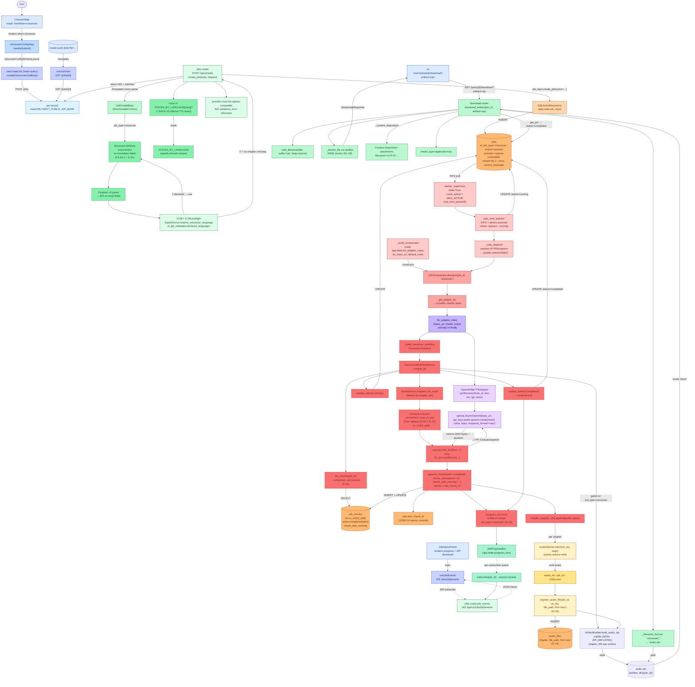

# Voice-Over Workflow

A user picks the **Voice-Over** card on the home page, fills in
`<VoiceoverConfigStep>` (OpenAI Base URL + API key + voice), and
clicks **Start voice-over**. The SPA `POST`s a `VoiceoverJobBody`
(`job_type="voiceover"`, `provider="openai-compatible"`, default
`model="tts-1"`, no translation fields) to `/api/v1/jobs`. The
FastAPI router auto-resolves `source_language` from
`EpubService.resolve_voiceover_language` (D-08 + D-09: single
declared → that language; ≥2 declared → first-spine chapter
`xml:lang`; 0 declared + no spine → 422 `source_language_required`),
validates `voice in VOICES_BY_LANGUAGE[source_language]`, persists
a `jobs` row (`status='queued'`, `voice`), and returns 202 +
`JobView`. The worker dequeues, `JobOrchestrator.dispatch`
instantiates a fresh `OpenAIHttpTTSAdapter` (bound to the row's
stored `model` + `voice` + the lifespan's OpenAI base URL), and
runs `VoiceOverWorkflowService` per-chunk. Each chunk is
synthesized to WAV bytes, persisted to `job_chunks` (with
`chunk_namespace='vo'`, optional `chunk_split_warning`), then
`AudioStitcher.stitch` concatenates per-sentence WAVs into a
per-chapter WAV written to `data/audio/{job_id}/ch{N}.wav` +
`audio_files` row. On completion, `ArtifactBuilder.build_audio_zip`
writes `{artifact_dir}/{job_id}/audio.zip`; the SPA streams the
ZIP from `GET /api/v1/jobs/{id}/download?artifact=zip`.

- **Entry endpoint:** `POST /api/v1/jobs` (voiceover variant)
- **Entry frontend component:** `<VoiceoverConfigStep>` (renders only when `?workflow=voiceover`)

## Key entities (real names from source)

| Layer | File | Entity / method |
|---|---|---|
| Frontend form | `frontend/src/components/VoiceoverConfigStep.tsx` | `VoiceoverConfigStep.handleSubmit` → `useCreateJob.mutate({job_type:"voiceover",…})` |
| Frontend client | `frontend/src/lib/api.ts` | `api.post<JobView>("/jobs", body)` |
| Frontend polling | `frontend/src/hooks/useJobView.ts` + `useJobEvents.ts` | `GET /api/v1/jobs/{id}` + `WS /api/v1/jobs/{id}/events` |
| Router | `backend/src/epubtv/api/routers/jobs.py` | `create_job(body, request)` |
| Schema | `backend/src/epubtv/api/schemas.py` | `JobCreateBody` (Annotated Union) → `VoiceoverJobBody` (no translation fields, defaults `provider="openai-compatible"`, `model="tts-1"`) |
| Voice catalog | `backend/src/epubtv/domain/voices.py` | `VOICES_BY_LANGUAGE` |
| Source language | `backend/src/epubtv/application/epub_service.py` | `EpubService.resolve_voiceover_language` + `get_metadata` |
| Repo | `backend/src/epubtv/adapters/persistence/sqlite_job_repository.py` | `SQLiteJobRepository.create_job / get_job / update_status / append_chunk(chunk_namespace='vo') / list_chunks / register_audio_file` |
| Worker | `backend/src/epubtv/application/worker_queue.py` | `worker_supervisor` + `_build_orchestrator` + `_safe_dispatch` |
| Orchestrator | `backend/src/epubtv/application/job_orchestrator.py` | `JobOrchestrator.dispatch` (per-dispatch `OpenAIHttpTTSAdapter` construction; BACK-10 ollama-as-TTS reject) |
| Workflow | `backend/src/epubtv/application/voiceover_workflow.py` | `VoiceOverWorkflowService.run(job_id)` + `CharacterChunker` |
| Chunker | `backend/src/epubtv/domain/chunkers.py` | `CharacterChunker.chunk` (3-tier fallback: sentence → mid-sentence → hard cut with `chunk_split_warning`) |
| TTS adapter | `backend/src/epubtv/adapters/tts/openai_http_tts_adapter.py` | `OpenAIHttpTTSAdapter.synthesize` (uses `openai.AsyncOpenAI.audio.speech.create`) |
| Audio stitch | `backend/src/epubtv/adapters/audio/audio_stitcher.py` | `AudioStitcher.stitch(chapter_idx, audio_segments)` (pydub reduce+add) |
| ZIP build | `backend/src/epubtv/application/artifact_service.py` | `ArtifactBuilder.build_audio_zip` (`zipfile.ZipFile ZIP_DEFLATED`) |
| Download | `backend/src/epubtv/api/routers/download.py` | `download_artifact` + `safe_filename` + `aiofiles` 64KB stream |
