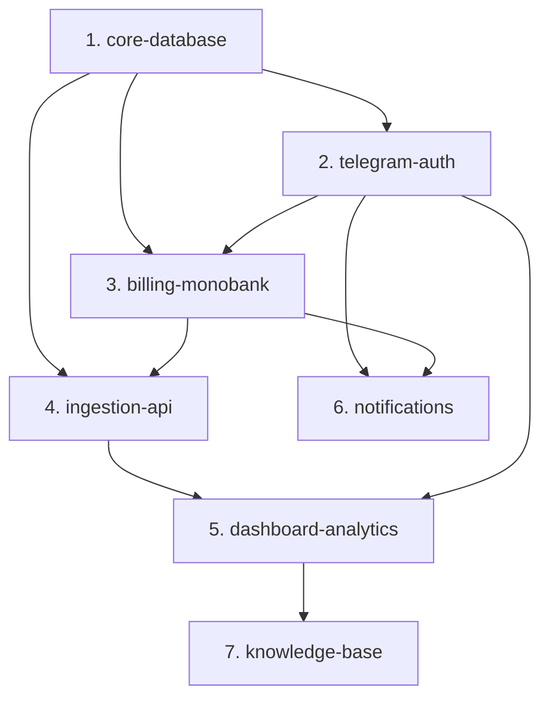

# Можливості OpenSpec та План Реалізації

Цей документ визначає розподіл вимог проекту, описаних у [requirements.md](file:///d:/home/Documents/Developer/2026-fwdays-agentic-greenfield-task/docs/requirements.md), на окремі логічні блоки — **можливості (capabilities)**. Кожна можливість буде розроблятися за методологією Spec-Driven Development за допомогою OpenSpec (через створення відповідних специфікацій у `openspec/specs/`).

---

## Залежності між можливостями

Для забезпечення швидкого та стабільного процесу розробки ми визначили таку схему залежностей між компонентами системи:

---

## Опис можливостей (Capabilities)

### 1. Базова база даних та ORM (`core-database`)
*   **Опис**: Налаштування Drizzle ORM, конфігурація підключення до PostgreSQL (Neon/Supabase) та створення базової схеми таблиць для збереження користувачів, сесій, підписок та конверсій. Також включає механізми шифрування чутливих даних користувача.
*   **Пов'язані вимоги**:
    *   `TC-STACK-03` — Drizzle ORM для роботи з PostgreSQL.
    *   `NFR-SEC-01` — шифрування збережених CRM-паролів та API-ключів за допомогою AES-256-GCM.
    *   `NFR-COST-01` — оптимізація під безкоштовні/мінімальні ліміти (Serverless).
*   **Результат у OpenSpec**: Створення `openspec/specs/core-database/spec.md`.

### 2. Реєстрація та авторизація через Telegram (`telegram-auth`)
*   **Опис**: Реалізація Telegram-бота, генерація QR-кодів та посилань реєстрації на сайті, збір даних користувача (email, website_url) у боті, створення профілю в БД, а також логіка безпарольного входу (Magic Link / 6-значний одноразовий код).
*   **Пов'язані вимоги**:
    *   `FR-AUTH-01` — обов'язковий зв'язок з ботом перед реєстрацією на сайті.
    *   `FR-AUTH-02` — генерація QR-коду та посилання `t.me/bot?start=reg_<temp_token>`.
    *   `FR-AUTH-03` — бот запитує email та `website_url` при запуску `/start`.
    *   `FR-AUTH-04` — створення користувача в БД та надсилання одноразового посилання для входу.
    *   `FR-AUTH-05` — автоматичний редірект на сайті після підтвердження в боті.
    *   `FR-AUTH-06` — повторна авторизація через Magic Link або 6-значний код.
    *   `TC-STACK-06` — використання `node-telegram-bot-api` або Next.js Route Handlers.
*   **Результат у OpenSpec**: Створення `openspec/specs/telegram-auth/spec.md`.

### 3. Керування підписками та Monobank Acquiring (`billing-monobank`)
*   **Опис**: Інтеграція з API monobank для прийому платежів та рекурентних списань. Створення інвойсів, токенізація карток, обробка вебхуків оплати, Cron-задача для автоматичного списання коштів та обробка статусів підписок (Active, Paused, Suspended, Cancelled).
*   **Пов'язані вимоги**:
    *   `FR-SUB-01` — два тарифи ($10.99/міс та $120/рік в еквіваленті UAH).
    *   `FR-SUB-02` — створення першої оплати з `saveCard: true` для отримання токена картки.
    *   `FR-SUB-03` — збереження `cardToken` та `walletId` в БД.
    *   `FR-SUB-04` — Cron-задача для рекурентного платежу (`initiationKind: "merchant"`).
    *   `FR-SUB-05` — повторні спроби списання (ще 2 рази за 48 годин) перед переведенням у `Suspended`.
    *   `FR-SUB-06` — тимчасова пауза підписки (статус `Paused` після завершення сплаченого періоду).
    *   `FR-SUB-07` — скасування підписки з модальним попередженням, видалення токену картки через `DELETE /api/merchant/wallet/card`.
    *   `TC-STACK-05` — інтеграція з Monobank Acquiring API.
*   **Результат у OpenSpec**: Створення `openspec/specs/billing-monobank/spec.md`.

### 4. REST API прийому конверсій (`ingestion-api`)
*   **Опис**: Створення безпечного та швидкодійного API-ендпоінту `/api/conversions` для імпорту даних про конверсії з Google Таблиць через Apps Script. Перевірка активності підписки перед прийомом даних та автоматичне очищення старої інформації.
*   **Пов'язані вимоги**:
    *   `FR-API-01` — ендпоінт `POST /api/conversions` для Apps Script.
    *   `FR-API-02` — автентифікація запитів за допомогою заголовка `X-API-Key`.
    *   `FR-API-03` — блокування запитів (помилка `402 Payment Required` або `403 Forbidden`), якщо підписка неактивна.
    *   `FR-API-04` — схема даних запису конверсії (date, time, value, source, channel тощо).
    *   `FR-API-05` — щоденне автоматичне очищення бази даних від записів, старших за 14 місяців.
    *   `NFR-PERF-01` — час відповіді API `POST /api/conversions` ≤ 200 мс на p95.
*   **Результат у OpenSpec**: Створення `openspec/specs/ingestion-api/spec.md`.

### 5. Особистий кабінет та Аналітика (`dashboard-analytics`)
*   **Опис**: Візуальний інтерфейс користувача на основі дизайну "Precision Hub" та Pure Light Mode. Форми внесення доступів до CRM/телефонії, віджети метрик, інтерактивні графіки динаміки та розподілу конверсій, таблиця логів з пагінацією та фільтрацією, а також генерація Apps Script коду.
*   **Пов'язані вимоги**:
    *   `FR-DASH-01` — форма внесення доступів CRM та телефонії в кабінеті.
    *   `FR-DASH-03` — генерація API-ключа та коду Apps Script для копіювання.
    *   `FR-DASH-04` — вибір періоду аналітики (до 14 місяців).
    *   `FR-DASH-05` — картки метрик (кількість, цінність, рекламні конверсії в абсолютних числах та %).
    *   `FR-DASH-06` — графік динаміки передачі (Line Chart).
    *   `FR-DASH-07` — кругові діаграми розподілу за джерелами та каналами.
    *   `FR-DASH-08` — таблиця 100 останніх конверсій з пагінацією та фільтрами.
    *   `NFR-PERF-02` — завантаження кабінету та звітів ≤ 500 мс.
    *   `TC-STACK-02` — використання Tailwind CSS v4 та shadcn/ui.
    *   `TC-STACK-04` — бібліотека Recharts для побудови графіків.
*   **Результат у OpenSpec**: Створення `openspec/specs/dashboard-analytics/spec.md`.

### 6. Система Telegram-сповіщень (`notifications`)
*   **Опис**: Інтеграція сповіщень у реальному часі для адміністратора та користувачів через Telegram-бот. Дані про події підписок збираються з бази та платіжного шлюзу.
*   **Пов'язані вимоги**:
    *   `FR-NOTIF-01` — сповіщення адміністратора в спеціальний чат з повною карткою клієнта.
    *   `FR-NOTIF-02` — сповіщення адміна про події: нова підписка, платіж, скасування, пауза, поновлення.
    *   `FR-NOTIF-03` — джерела даних (Телефон, Час, Ім'я з monobank; email, сайт, username з бази даних).
    *   `FR-NOTIF-04` — вітальне сповіщення користувача з лінком на інструкцію.
    *   `FR-NOTIF-05` — попередження про невдале списання та загрозу зупинки з посиланням на оплату.
    *   `FR-NOTIF-06` — сповіщення про фактичне призупинення сервісу з посиланням на оплату.
*   **Результат у OpenSpec**: Створення `openspec/specs/notifications/spec.md`.

### 7. База знань та Загальні сторінки (`knowledge-base`)
*   **Опис**: Створення публічних сторінок (Landing Page, FAQ) та повної бази знань з покроковими інструкціями для інтеграції GA4, Google Ads, Google Cloud та Binotel.
*   **Пов'язані вимоги**:
    *   `FR-DASH-02` — відображення детальних інструкцій для GA4, Google Ads, Google Cloud та Binotel.
    *   `NFR-I18N-01` — виключно українська локалізація інтерфейсу та бота.
    *   `BC-BRAND-01` — спокійний, практичний тон без знаків оклику.
    *   `BC-PRIVACY-01` — відсутність сторонніх трекерів аналітики та cookie.
*   **Результат у OpenSpec**: Створення `openspec/specs/knowledge-base/spec.md`.

---

## Рекомендована черга реалізації (Implementation Plan)

Реалізація відбуватиметься поетапно, де кожен крок спирається на завершений попередній:

| Етап | Можливість | Пріоритет | Обґрунтування |
| :--- | :--- | :--- | :--- |
| **1** | [core-database](file:///d:/home/Documents/Developer/2026-fwdays-agentic-greenfield-task/openspec/specs/core-database/spec.md) | **Critical** | Базові таблиці та ORM необхідні для збереження користувачів та їхніх станів на будь-якому іншому кроці. |
| **2** | [telegram-auth](file:///d:/home/Documents/Developer/2026-fwdays-agentic-greenfield-task/openspec/specs/telegram-auth/spec.md) | **High** | Без Telegram-бота користувач не може зареєструватися чи увійти. Це вхідні двері платформи. |
| **3** | [billing-monobank](file:///d:/home/Documents/Developer/2026-fwdays-agentic-greenfield-task/openspec/specs/billing-monobank/spec.md) | **High** | Створює білінговий статус користувача. API прийому конверсій не може приймати дані без перевірки цього статусу. |
| **4** | [ingestion-api](file:///d:/home/Documents/Developer/2026-fwdays-agentic-greenfield-task/openspec/specs/ingestion-api/spec.md) | **Medium** | Забезпечує надходження даних про конверсії в систему. Без цього аналітичні графіки будуть пустими. |
| **5** | [dashboard-analytics](file:///d:/home/Documents/Developer/2026-fwdays-agentic-greenfield-task/openspec/specs/dashboard-analytics/spec.md) | **Medium** | Візуалізація отриманих даних та налаштування інтеграцій користувачем. |
| **6** | [notifications](file:///d:/home/Documents/Developer/2026-fwdays-agentic-greenfield-task/openspec/specs/notifications/spec.md) | **Low** | Додає зручності: сповіщення про платежі, попередження про відхилення оплат. |
| **7** | [knowledge-base](file:///d:/home/Documents/Developer/2026-fwdays-agentic-greenfield-task/openspec/specs/knowledge-base/spec.md) | **Low** | Документаційні сторінки та публічна частина, що завершують MVP. |
