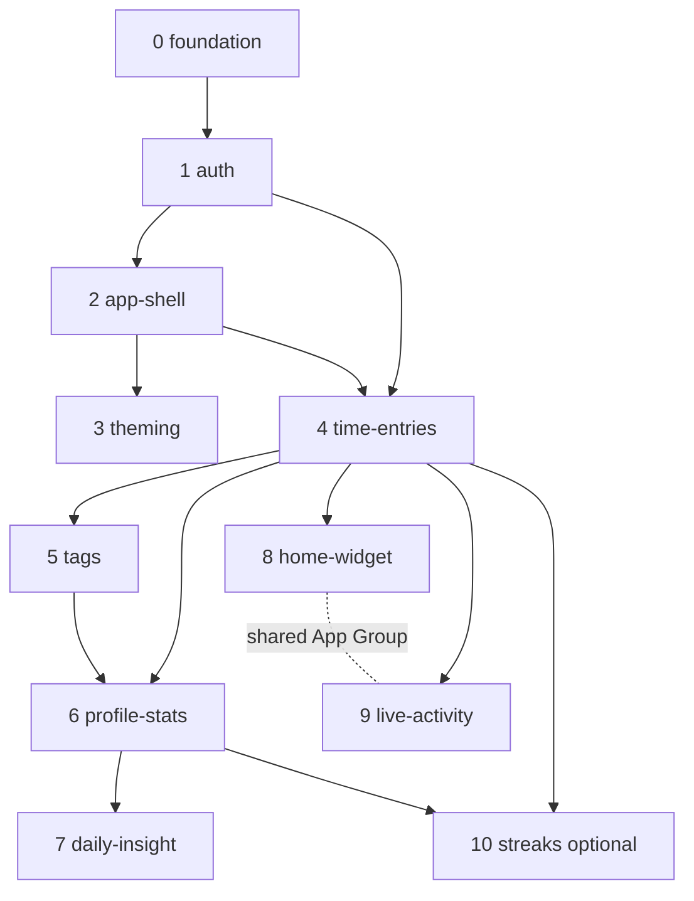

# Implementation plan — capabilities & order

How we slice [docs/requirements.md](requirements.md) into **OpenSpec capabilities** and the
**order** we build them. Each capability below becomes an `openspec/specs/<capability>/`
spec, populated through one or more `openspec/changes/<change-id>/` proposals
(`openspec change new …` → apply → `openspec archive`). `requirements.md` stays the source
of truth; this file is the build roadmap.

> Capability names mirror the `capability` labels already in `requirements.md`, so the
> traceability (FR/NFR/TC IDs) carries straight through. Per-capability descriptions live in
> [docs/capabilities/](capabilities/) (one file each, numbered by build order).

---

## Capability map

| # | Capability (spec) | Requirement IDs | Packages touched | Depends on | Pure-logic surface |
|---|-------------------|-----------------|------------------|------------|--------------------|
| 0 | `foundation` *(infra, not an FR set)* | TC-STACK-01/02/03, TC-PURE-01, TC-TEST-01, NFR-DX-01 | shared, api, mobile, db | — | contracts skeleton |
| 1 | `auth` | FR-AUTH-01→06; NFR-SEC-01; TC-STACK-04 | api, mobile, shared | foundation | password strength check |
| 2 | `app-shell` | FR-SHELL-01→03 | mobile, shared | auth | — |
| 3 | `theming` | FR-THEME-01→04; NFR-A11Y-02 | mobile | app-shell | — |
| 4 | `time-entries` | FR-ENTRY-01→11; NFR-PERF-01/02 | shared, api, mobile | auth, app-shell | **duration fmt (FR-ENTRY-09)** |
| 5 | `tags` | FR-TAG-01→04 | shared, api, mobile | time-entries | — |
| 6 | `profile-stats` | FR-STATS-01→05 | shared, api, mobile | time-entries, tags | **aggregation (FR-STATS-05)** |
| 7 | `daily-insight` | FR-INSIGHT-01→06; TC-STACK-07; NFR-COST-01 | shared, api, mobile | profile-stats | **insight-input shaping (FR-INSIGHT-04)** |
| 8 | `home-widget` | FR-WIDGET-01→05; TC-NATIVE-01/02/03; NFR-WIDGET-01 | mobile (native ext) | time-entries | — (reuses core) |
| 9 | `live-activity` | FR-LIVE-01→05; TC-NATIVE-01/02/03; NFR-WIDGET-01 | mobile (native ext) | time-entries | — (reuses core) |
| 10 | `streaks` *(optional)* | FR-STREAK-01→04 | shared, api, mobile | time-entries, profile-stats | **streak calc (FR-STREAK-04)** |

Every FR is covered (auth 6 · shell 3 · theme 4 · entries 11 · tags 4 · stats 5 · widget 5 ·
live 5 · insight 6 · streaks 4 = 53).

---

## Dependency graph



---

## Recommended order (phases)

Build in dependency order; ship the lean MVP spine first, then differentiators. Each phase
is one or more OpenSpec changes. Within a capability, split changes by layer and go
**test-first on pure logic** (per AGENTS.md): shared contracts/pure fns → api endpoints (DTO
validation, TC-STACK-02) → mobile UI.

| Phase | Capabilities | Why here | Candidate OpenSpec change(s) |
|-------|--------------|----------|------------------------------|
| **0. Foundation** *(in progress)* | `foundation` | Monorepo, `@honeydo/shared`, Prisma/Postgres, design tokens, health endpoint already scaffolded. | `add-foundation` (or treat as done) |
| **1. Gated app** | `auth` → `app-shell` → `theming` | Nothing is usable until login + gated navigation exist; everything is user-scoped (BC-SCOPE-01). `app-shell` provides the four tabs (Timer, History, Stats, Profile) that later capabilities fill. Theming underpins all screens (tokens already integrated). | `add-auth`, `add-app-shell`, `add-theming` |
| **2. Core loop** | `time-entries` | The MVP's spine (BC-DEMO-01): start/stop/manual/edit/delete/continue + pure duration. Fills **two** app-shell tabs — the **Timer** screen (loop) and the **History** screen (day-grouped list); History is a view of the same entries, not a separate capability. | `add-time-entries-core` (likely split: `-api`, `-mobile`) |
| **3. Organize** | `tags` | Tagging + history filtering builds directly on entries. | `add-tags` |
| **4. Review** | `profile-stats` | Weekly chart + totals + per-tag breakdown; pure aggregation. Needs entries (+ tags). | `add-profile-stats` |
| **5. AI** | `daily-insight` | Server-side insight consumes the **numeric summary** from stats aggregation (FR-INSIGHT-04); reuses Phase-4 pure fns. Anthropic API, backend-only (TC-STACK-07). | `add-daily-insight` |
| **6. iOS surfaces** | `home-widget` → `live-activity` | The product's main differentiator, but native extensions need Dev Client + prebuild (TC-NATIVE-01) and a stable core to toggle. Widget + Live Activity share an App Group; build widget first, then Live Activity. | `add-home-widget`, `add-live-activity` |
| **7. Habit (optional)** | `streaks` | Cheap, strong unit-test surface; promote or defer at scope sign-off. Needs daily totals + a goal setting. | `add-streaks` |

---

## Cross-cutting concerns (apply in every change, not separate specs)

- **TC-PURE-01 / TC-TEST-01** — duration, aggregation, streak, insight-shaping live in
  `packages/shared` (framework-free) and are 100% unit-tested. Write these **first** inside
  their capability's change.
- **FR-THEME-03 / DESIGN.md** — no hardcoded colors; all UI uses design tokens.
- **NFR-OBS-01** — every failure degrades to a calm, visible state; the insight has a
  deterministic fallback (FR-INSIGHT-06).
- **NFR-A11Y-01/02, NFR-COPY-01** — accessible labels, AA contrast both themes,
  centralized English-only copy.
- **NFR-DX-01** — backend `lint && typecheck && test && build` < 60 s.
- **TC-STACK-05/06** — TanStack Query (optimistic timer updates) and the chart lib land
  with `time-entries` / `profile-stats` respectively.
- **Maker ≠ checker** — separate review pass before merge (AGENTS.md workflow).

---

## Risks / decisions to resolve before the dependent phase

- **Brand mismatch (blocks Phase 1 `theming` / any UI).** `requirements.md` (BC-BRAND-01)
  and `product-brief.md` describe a **dark/blackwork** identity, but the integrated design
  system (DESIGN.md, `honeydo-design` skill) is a **warm honey** theme. Pick the canonical
  one before building screens. Tracked in [current-state.md](current-state.md).
- **Native build pipeline (blocks Phase 6).** Widget + Live Activity require Expo Dev Client
  + prebuild and an Apple Developer setup (TC-NATIVE-01/02, TC-DEPLOY-01) — not buildable in
  Expo Go. Plan the prebuild migration before Phase 6.
- **Anthropic API access (blocks Phase 5).** `daily-insight` needs an API key wired
  server-side only (TC-STACK-07, FR-INSIGHT-02).
- **Streaks promotion (Phase 7).** Decide at scope sign-off whether `streaks` is MVP-core or
  deferred to Future.

---

## How to start a capability with OpenSpec

```bash
# scaffold a change proposal for the next capability
openspec new change add-auth
# …draft proposal/specs/tasks, then implement test-first…
openspec validate add-auth
openspec archive add-auth      # promotes deltas into openspec/specs/auth/
```

Order to scaffold: `add-auth` → `add-app-shell` → `add-theming` → `add-time-entries-core`
→ `add-tags` → `add-profile-stats` → `add-daily-insight` → `add-home-widget`
→ `add-live-activity` → (`add-streaks`).
