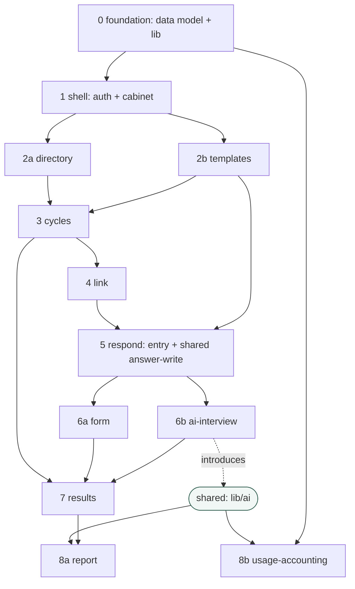

# MVP capability plan — Kolo360

The MVP from `docs/requirements.md`, sliced into capabilities for build. Each slice
is built as **one OpenSpec change** end to end:

```
/opsx:propose "<slice>"   → proposal.md + design.md + tasks.md + spec deltas (GIVEN/WHEN/THEN, citing FR IDs)
/opsx:apply               → implement test-first (red → green)
/opsx:archive             → sync openspec/specs/ and archive the change
```

Rules honoured here (course gate **G3**):
- **One owner per requirement** — every MVP `FR-*` is owned by exactly one slice (no
  gaps, no duplicates). See the coverage check at the end.
- **Dependencies marked** — build in topological order; disjoint slices may run in
  parallel (separate git worktrees). Anything touching a shared module is serialised.
- **Human checkpoint** — this plan is signed off by a human before implementation.

Cross-cutting `NFR-*`, `TC-*`, `BC-*` are **not** owned by a single slice — they are
standards every slice must meet (typing, Zod, design system, privacy, a11y,
verification loop). They are enforced by `AGENTS.md` + the verification gates.

## Slices

| #  | Capability | OpenSpec change | Owns (FR) | Depends on | Parallel-safe with | Notes |
|----|-----------|-----------------|-----------|------------|--------------------|-------|
| 0  | foundation | `add-foundation` | — (infra) | — | — | Prisma schema for all entities (Employee, Template, Question, Cycle, Response, Answer, Dialog, Summary, UsageRow), shared `lib/db` client, base `lib/schemas` (Zod), `lib/i18n` scaffold. Enables everything. Implements TC-STACK-02/04, TC-VALID-01, TC-PURE-01 base. |
| 1  | shell | `add-cabinet-shell` | FR-AUTH-01..05, FR-SHELL-01..03 | 0 | — | Sign-in + httpOnly access/refresh cookies; HR cabinet layout (sidebar + sticky header) and the separate respondent shell. |
| 2a | directory | `add-employee-directory` | FR-DIR-01..04 | 0, 1 | 2b | Add/list/edit/archive employees; name+email required. |
| 2b | templates | `add-templates` | FR-TPL-01..03 | 0, 1 | 2a | Seeded read-only templates (scale + open questions); respondent preview. |
| 3  | cycles | `add-cycles` | FR-CYCLE-01..05 | 2a, 2b | — | Create + launch a cycle (subject + template snapshot + deadline + status). |
| 4  | link | `add-respondent-link` | FR-LINK-01..03 | 3 | — | Private `/respond/[token]`; copy link; expired/unknown token page. |
| 5  | respond | `add-respond-entry` | FR-RESP-01..03 | 4, 2b | — | Intro + confidentiality, mode choice, and the **shared per-question answer-write** (FR-RESP-03) that form & interview both reuse. |
| 6a | form | `add-web-form` | FR-FORM-01..04 | 5 | 6b | Paged form, scale/open controls, per-section autosave, resumable. |
| 6b | ai-interview | `add-ai-interview` | FR-AI-01..09 | 5 | 6a | Server-side streamed chat interview; introduces the shared `lib/ai` module (prompts, sufficiency/grounding rules). |
| 7  | results | `add-results-progress` | FR-PROGRESS-01..03 | 3, 6a, 6b | — | Live progress + per-question answers for HR; raw dialog view (HR-only). |
| 8a | report | `add-ai-summary` | FR-REPORT-01..04 | 7 (+ `lib/ai`) | 8b | Grounded AI summary (structured), report styling. |
| 8b | usage-accounting | `add-usage-accounting` | FR-USAGE-01..04 | 0 (+ `lib/ai`) | 8a | Record token usage per AI call; cost in USD from a configurable price table; HR spend view. |

## Dependency graph



## Shared modules (serialisation points — do not edit concurrently)

- **`prisma/schema.prisma`** — defined once in slice 0 with all MVP entities, so later
  slices read it without racing migrations. Schema changes after slice 0 are serialised.
- **`lib/ai/`** — introduced in slice 6b (ai-interview), reused by 8a (report) and 8b
  (usage-accounting). One owner at a time.
- **Shared answer-write** (`FR-RESP-03`) — defined in slice 5 so form (6a) and interview
  (6b) write identically. After slice 5 they are disjoint and can run in parallel.
- **`lib/i18n/uk.ts`** — every slice appends strings; append-only, low-conflict, but keep
  one entry per key.

## Coverage check — every MVP FR owned exactly once

- `shell` → FR-AUTH-01, -02, -03, -04, -05 · FR-SHELL-01, -02, -03
- `directory` → FR-DIR-01, -02, -03, -04
- `templates` → FR-TPL-01, -02, -03
- `cycles` → FR-CYCLE-01, -02, -03, -04, -05
- `link` → FR-LINK-01, -02, -03
- `respond` → FR-RESP-01, -02, -03
- `form` → FR-FORM-01, -02, -03, -04
- `ai-interview` → FR-AI-01, -02, -03, -04, -05, -06, -07, -08, -09
- `results` → FR-PROGRESS-01, -02, -03
- `report` → FR-REPORT-01, -02, -03, -04
- `usage-accounting` → FR-USAGE-01, -02, -03, -04

No FR appears twice; no MVP FR is unassigned. ✅

## Suggested first slice (teaching the loop)

The build order starts at **slice 0 (foundation)**. But to learn the OpenSpec
red→green→eval loop cleanly first, a good warm-up is a **pure `lib/` function** with no
DB/auth — the Kolo360 analog of the course's `comfort-score`:

- **answer-sufficiency rule** (`FR-AI-03`) — pure: given a question + a reply, decide
  sufficient / needs-follow-up. Unit-testable, and a natural **eval** target (does it
  correctly judge thin vs concrete answers?), OR
- **token-cost calc** (`FR-USAGE-02`, `-04`) — pure: model + tokens + price table → USD.
  The simplest possible first slice.

These let us practise spec → failing test → implementation → green before we wire the
heavier foundation.
