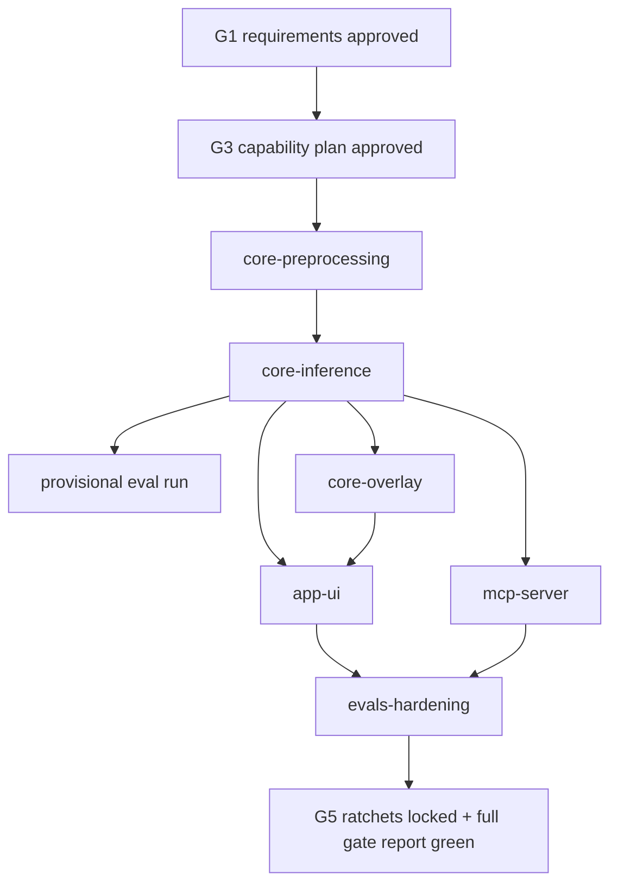

# MVP Capability Plan

Status: G3 approved with amendments (2026-07-07).

G1 requirements review passed on 2026-07-03. Implementation slices may proceed after this plan.

## Cross-Cutting Constraints

These constraints are **not owned by a single slice**. They are verified continuously by gates, checkers, and architecture boundaries:

| ID | Constraint | Verification |
| --- | --- | --- |
| `TC-STACK-01` | .NET 10 MAUI stack with C# nullable enabled | CI build matrix, project TFMs, format/build gates |
| `TC-MODEL-01` | Custom Vision compact ONNX contract per `docs/model-contract.md` | Core unit tests, OpenSpec preprocessing/detection specs, spec-compliance audits |
| `BC-OFFLINE-01` | No network calls for inference | Code review, security review, Core purity checks |
| `BC-PRIVACY-01` | User images remain local during detection | Code review, security review, architecture boundaries |

## Overlay Ownership

- **Core** owns all overlay geometry math and any Core-side drawing primitives needed for annotated output coordinates.
- **app-ui** only displays annotated previews using Core-provided geometry/results; it must not duplicate crop/tensor/box conversion logic.

## Eval Strategy

- **`core-inference`**: run a **provisional** output eval against `evals/dataset/` for signal only; do not lock or ratchet baselines.
- **`evals-hardening` (G5)**: generate `expected.json`, lock output-eval and coverage ratchets, and produce the full gate report.

## Slice Table

| Slice | Primary Owner | Requirement IDs | Scope | Gate |
| --- | --- | --- | --- | --- |
| `core-preprocessing` | `capability-implementer` | `FR-PREPROC-01`, `FR-PREPROC-02`, `FR-PREPROC-03`, `TC-MODEL-01` | Core image decode/crop/resize/tensor creation tests and implementation. | G4.1 |
| `core-inference` | `capability-implementer` | `FR-DETECT-01`, `FR-DETECT-02`, `FR-DETECT-03`, `BC-OFFLINE-01`, `BC-PRIVACY-01` | Core detector contracts, ONNX session wrapper, label mapping, thresholding, output parsing; **provisional eval run**. | G4.2 |
| `core-overlay` | `capability-implementer` | `FR-OVERLAY-01` | Core coordinate conversion from model/crop space to displayed preview space; Core owns geometry. | G4.3 |
| `app-ui` | `capability-implementer` | `FR-CAPTURE-01`, `FR-PICK-01`, `FR-OVERLAY-02`, `NFR-PERF-01`, `NFR-STARTUP-01` | MAUI MVVM capture/pick flow, lazy detector initialization, off-UI-thread detection, display-only annotated preview. | G4.4 |
| `mcp-server` | `capability-implementer` | `FR-MCP-01`, `FR-MCP-02` | MCP tools `detect_objects(imagePath)` and `get_model_info()` wrapping Core. | G4.5 |
| `evals-hardening` | `test-engineer` | `NFR-EVAL-01`, `NFR-TEST-01` | `expected.json`, real-model eval runner, output baseline, coverage baseline, full gate report. | G5 |

## Dependency DAG

## Coverage Check

Every MVP `FR-*` has exactly one owning slice:

- `FR-CAPTURE-01` -> `app-ui`
- `FR-PICK-01` -> `app-ui`
- `FR-PREPROC-01` -> `core-preprocessing`
- `FR-PREPROC-02` -> `core-preprocessing`
- `FR-PREPROC-03` -> `core-preprocessing`
- `FR-DETECT-01` -> `core-inference`
- `FR-DETECT-02` -> `core-inference`
- `FR-DETECT-03` -> `core-inference`
- `FR-OVERLAY-01` -> `core-overlay`
- `FR-OVERLAY-02` -> `app-ui` (display only)
- `FR-MCP-01` -> `mcp-server`
- `FR-MCP-02` -> `mcp-server`

## Slice Protocol

For each G4 slice:

1. Read `docs/current-state.md`, this plan, the relevant PRD rows, and relevant OpenSpec specs.
2. Spec writer confirms or updates scenarios for only this slice.
3. Test engineer writes red tests before implementation and records the red command.
4. Capability implementer makes the smallest green change.
5. Run format, build, tests, evals, OpenSpec strict validation, and all `scripts/check-*.cs`.
6. Run checker passes: code review, security review when relevant, spec compliance audit, and eval judge.
7. Update `docs/current-state.md` and commit with `Slice: <name>` or `Refs: FR-*`.
