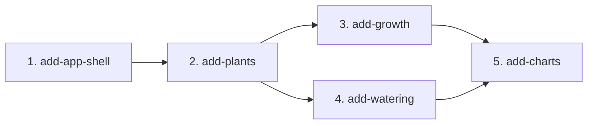

# MVP Capability Change Plan — Plant Growth & Watering Tracker

**Phase 3 of the SDD process** — split the MVP into capability changes the
delivery loop executes one-by-one (proposal → spec deltas → design → tasks →
tests(red) → implement(green) → review gate → archive).

> Inputs: `docs/product-brief.md`, `docs/requirements.md` (incl. SC-1..SC-6),
> the baseline specs under `openspec/specs/`, and ADR-0001 (stack).

## 1. Slicing principles

1. One slice ≈ one cohesive capability, built/tested/archived as a unit.
2. Dependency-respecting order — foundations first; no slice depends on a
   sibling shipping after it.
3. One owner per requirement — every MVP FR assigned to exactly one slice.
   Cross-cutting NFRs (§2) are honored by EVERY slice.
4. Baseline-spec aligned; one slice per baseline spec (none are coupled enough
   to bundle).
5. Naming: kebab-case `add-<capability>` under `openspec/changes/`.

## 2. The capability changes

| # | Change name | Baseline specs | MVP FRs | NFRs travelled | Depends on | Parallel |
|---|---|---|---|---|---|---|
| 1 | `add-app-shell` | app-shell | FR-SHELL-01, 02, 03 | NFR-A11Y-01/02/04, NFR-USA-01, NFR-COMPAT-01/02, NFR-LOC-01 | — | serialize (foundation; shared layout) |
| 2 | `add-plants` | plants | FR-PLANT-01..08 | NFR-USA-02, NFR-DATA-01/02, NFR-PERF-01 | 1 | serialize (first migration; shared plant-detail page) |
| 3 | `add-growth` | growth | FR-GROWTH-01..05 | NFR-USA-03, NFR-PERF-01, NFR-DATA-01/02 | 2 | serialize (migration + edits plant-detail page) |
| 4 | `add-watering` | watering | FR-WATER-01..05 | NFR-USA-03, NFR-PERF-01, NFR-DATA-01/02 | 2 | serialize (migration + edits plant-detail page) |
| 5 | `add-charts` | charts | FR-CHART-01..04 | NFR-A11Y-03, NFR-PERF-02 | 3, 4 | serialize (reads growth+watering; edits plant-detail page) |

**Parallel note.** `add-growth` and `add-watering` are domain-disjoint
(`lib/growth/` vs `lib/watering/`, separate schema files) BUT both add a Drizzle
migration AND both render onto the same plant-detail page — two conditions that
force **serialization**. For a deliberately small app the whole chain is linear;
no worktree parallelism is used.

**Cross-cutting NFRs every change MUST honor:**
- NFR-A11Y-01 (axe light+dark + vision pass), NFR-A11Y-02 (AA contrast),
  NFR-A11Y-04 (keyboard + labels).
- NFR-USA-01 (≤2 clicks), NFR-USA-02 (validation + confirm on destructive),
  NFR-USA-03 (local date display).
- NFR-PERF-01 (mutations reflect <300 ms locally).
- NFR-DATA-01 (persist across restart), NFR-DATA-02 (no silent loss).
- NFR-COMPAT-01 (responsive ≥360 px), NFR-COMPAT-02 (evergreen browsers).
- NFR-SEC-01 (no auth/secrets), NFR-LOC-01 (Ukrainian UI).
- SC-1..SC-6 (date entry/display, future-date rejection, list ordering,
  persistence, delete safety, keyboard+labels) from `docs/requirements.md`.

## 3. Dependency graph

**Critical path:** app-shell → plants → growth → watering → charts (linear).
**Parallelizable:** none in MVP — growth/watering share the plant-detail page and
both add migrations, so they serialize.

## 4. Per-change scope and exit criteria

### 4.1 `add-app-shell`

- **Scope in:** root layout + a single app shell; nav between plant list (`/`)
  and plant detail (`/plants/[id]`); light/dark theme toggle persisted in
  `localStorage` and applied without flash; the **shared inline form-error
  pattern** (a reusable `<FieldError>` / form-error banner + a result type
  server actions return) that every later slice reuses; Ukrainian UI copy.
- **Scope out:** any plant data/CRUD (FR-PLANT-*, slice 2); auth (FR-SHELL-05);
  export/import (FR-SHELL-04).
- **Baseline spec impact:** owns app-shell/spec.md (FR-SHELL-01/02/03).
- **Definition of done:** shell renders in both themes (axe clean light+dark,
  vision pass), theme choice survives reload; nav reachable by keyboard with
  labels; an example form demonstrates the inline-error pattern (no raw 500, no
  silent failure); `npm run build` + unit tests green.
- **Risks:** theme-flash on first paint (mitigate with an inline pre-hydration
  script); establishing the error-pattern API shape that slices 2–5 depend on —
  get it right here.

### 4.2 `add-plants`

- **Scope in:** `db/schema/plants.ts` + first migration; `lib/plants/`
  (validation/queries/service/actions); plant list (empty state) + detail pages;
  add/edit/delete (delete cascades the plant's own children, confirmed); species
  defaults to "money tree / Crassula ovata"; acquired date via SC-1 picker.
- **Scope out:** measurements (slice 3), waterings (slice 4), charts (slice 5),
  photos (FR-PLANT-09), search/filter (FR-PLANT-10).
- **Baseline spec impact:** owns plants/spec.md (FR-PLANT-01..08).
- **Definition of done:** real-SQLite smoke flow (create→read→edit→delete with
  cascade) passes; future acquired date rejected inline (SC-2); list empty state
  shown; data persists across restart (NFR-DATA-01); mutations <300 ms
  (NFR-PERF-01); axe+vision clean; build + unit + integration green.
- **Risks:** cascade-delete correctness (FK `on delete cascade` + confirm);
  this is the first migration — sets the migration workflow.

### 4.3 `add-growth`

- **Scope in:** `db/schema/growth.ts` + migration (FK→plant, cascade);
  `lib/growth/`; on the plant-detail page, a measurements section: log (height
  cm, date default today), list (date desc, id-desc tie-break per SC-3),
  edit, delete (single row, NFR-DATA-02). FR-GROWTH-05 number validation
  (reject non-numeric/negative; accept decimals, trailing zeros, decimal commas).
- **Scope out:** charts (slice 5); extra metrics (FR-GROWTH-06).
- **Baseline spec impact:** owns growth/spec.md (FR-GROWTH-01..05).
- **Definition of done:** unit tests cover the number parser edge cases
  (`12,5` → 12.5, `12.50`, blank, `-3`, `abc`); future date rejected (SC-2);
  smoke flow passes; persists across restart; axe+vision clean; battery green.
- **Risks:** locale number parsing (decimal comma) — pure-function, test-first.

### 4.4 `add-watering`

- **Scope in:** `db/schema/watering.ts` + migration (FK→plant, cascade);
  `lib/watering/`; on the plant-detail page, a waterings section: log (date
  default today, optional note), list (date desc, id-desc tie-break), edit,
  delete (single row). SC-1 date rules; SC-2 future-date rejection.
- **Scope out:** water amount (FR-WATER-06); reminders (FR-WATER-07); charts.
- **Baseline spec impact:** owns watering/spec.md (FR-WATER-01..05).
- **Definition of done:** smoke flow passes; optional note round-trips; future
  date rejected; persists across restart; axe+vision clean; battery green.
- **Risks:** none beyond shared plant-detail page merge (serialized after growth).

### 4.5 `add-charts`

- **Scope in:** on the plant-detail page, a **watering chart** (events over time,
  the headline feature) and a **growth chart** (height over time) with Recharts;
  each chart has a clear empty state (FR-CHART-03); charts reflect add/edit/delete
  (FR-CHART-04); underlying values remain readable as the existing growth/watering
  lists (NFR-A11Y-03); chart controls keyboard-operable + labeled.
- **Scope out:** granularity/range controls (FR-CHART-05); insights (FR-CHART-06).
- **Baseline spec impact:** owns charts/spec.md (FR-CHART-01..04).
- **Definition of done:** charts render within 500 ms for ≤365 points
  (NFR-PERF-02); empty states verified; values still available as lists; axe +
  **vision pass** confirms charts are legible in both themes (a chart is exactly
  the kind of rendered output DOM tests are blind to); battery green.
- **Risks:** Recharts responsive container + dark-theme contrast; SSR/client
  boundary (charts are client components) — verify no hydration mismatch.

## 5. FR coverage check

| FR | Slice | FR | Slice | FR | Slice |
|---|---|---|---|---|---|
| FR-PLANT-01 | 2 | FR-GROWTH-01 | 3 | FR-WATER-01 | 4 |
| FR-PLANT-02 | 2 | FR-GROWTH-02 | 3 | FR-WATER-02 | 4 |
| FR-PLANT-03 | 2 | FR-GROWTH-03 | 3 | FR-WATER-03 | 4 |
| FR-PLANT-04 | 2 | FR-GROWTH-04 | 3 | FR-WATER-04 | 4 |
| FR-PLANT-05 | 2 | FR-GROWTH-05 | 3 | FR-WATER-05 | 4 |
| FR-PLANT-06 | 2 | FR-CHART-01 | 5 | FR-SHELL-01 | 1 |
| FR-PLANT-07 | 2 | FR-CHART-02 | 5 | FR-SHELL-02 | 1 |
| FR-PLANT-08 | 2 | FR-CHART-03 | 5 | FR-SHELL-03 | 1 |
| | | FR-CHART-04 | 5 | | |

Total: **25 MVP FRs across 5 slices** (no gaps, no duplicates).

## 6. Sequencing

Implement in dependency order (1→2→3→4→5). After each archive run
`npx openspec validate --all --strict` before starting the next slice. Future
work (FR-*-Future, NFRs deploy-gated) is NOT in this plan.
