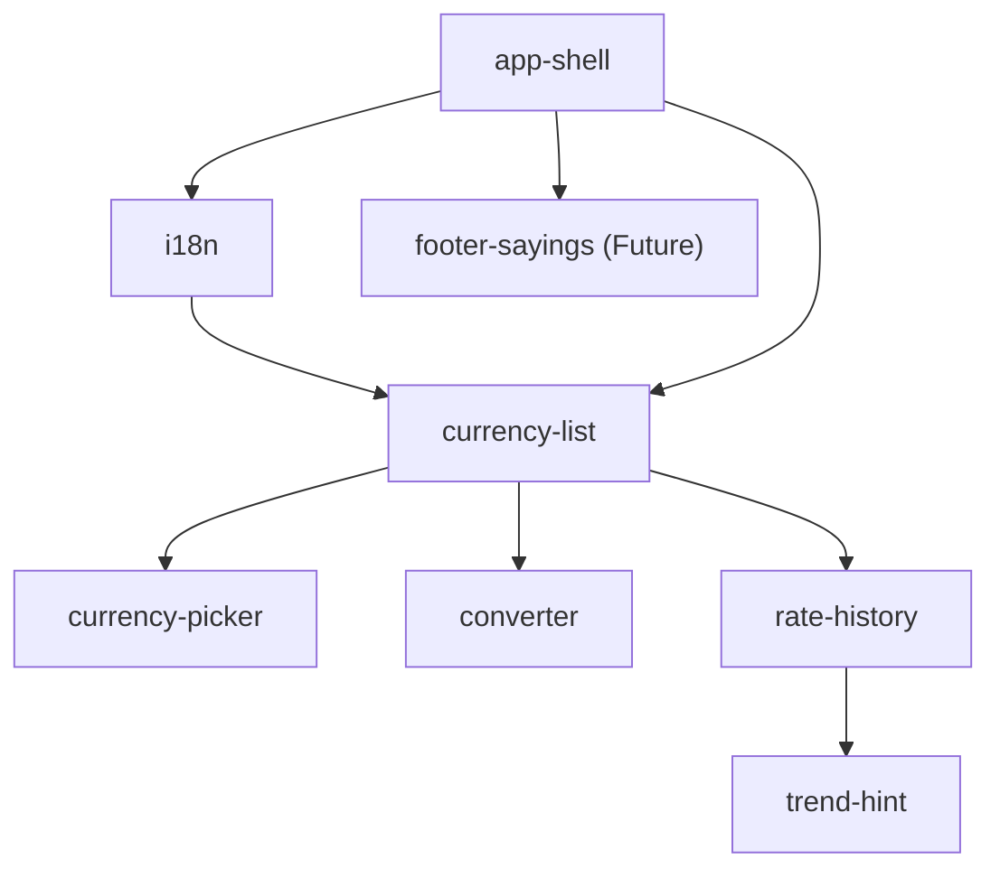

# MVP capability plan — «Гривня»

> The build plan: how the MVP is sliced, in what order, and what "done" means per
> slice. Each slice maps 1:1 to an OpenSpec capability spec under
> [../openspec/specs/](../openspec/specs/) and is built through the per-slice loop
> (tests-first → green → two-checker review → archive).
> Requirements: [requirements.md](requirements.md) · Decisions: [adr/](adr/).

---

## Slice table

| # | Slice (capability) | FRs | Depends on | Scope (one line) |
|---|---|---|---|---|
| 1 | `app-shell` | FR-SHELL-01..04 | — | Header (lockup + theme toggle), main, footer; responsive two-column; loading/empty skeletons. |
| 2 | `i18n` | FR-I18N-01 (NFR-I18N-01) | app-shell | `lib/i18n/uk.ts` + typed accessor; move shell strings into it. |
| 3 | `currency-list` | FR-RATES-01..05 | app-shell, i18n | Server fetch of today's NBU rates; rows (flag/code/name/rate); as-of + stale; select active; honest failure. |
| 4 | `currency-picker` | FR-PICK-01..03 | currency-list | Filter the list by code/name; inline «Нічого не знайдено»; select sets active. |
| 5 | `converter` | FR-CONVERT-01..05 | currency-list | UAH ⇄ active currency at official rate; locale-aware in/out; swap; total arithmetic. |
| 6 | `rate-history` | FR-HISTORY-01..04 | currency-list | ~30-day line of the active currency; NBU window fetch; loading/empty/error; honest y-domain. |
| 7 | `trend-hint` | FR-TREND-01..03 | rate-history | 7-day signed move; one calm Ukrainian sentence; `trendTone` flat band. |
| 8 | `footer-sayings` *(Future)* | FR-SAYINGS-01 | app-shell | Deterministic day-of-year Ukrainian one-liner; no API. Optional; promote if time allows. |

**Pure-logic modules introduced (framework-free `lib/`, colocated tests):**
`lib/nbu/` (response → domain mappers + fetch wrapper) · `lib/currency/convert.ts`,
`parseAmount.ts` · `lib/currency/rateMove.ts` (trend) · `lib/i18n/uk.ts` ·
`lib/sayings/` *(Future)*. `trendTone` is reused from the design system.

---

## Dependency graph (acyclic)

Textual edges (parent → child): `app-shell → i18n`, `app-shell → currency-list`,
`i18n → currency-list`, `currency-list → {currency-picker, converter, rate-history}`,
`rate-history → trend-hint`, `app-shell → footer-sayings`.

**Acyclic:** yes — every edge points to a later slice; no back-edges, no cycles.

**Critical path:** `app-shell → i18n → currency-list → rate-history → trend-hint`
(5 slices). `currency-picker` and `converter` branch off `currency-list` and can be
built in any order after it; `footer-sayings` is independent (and deferred).

**Recommended build order:**
`app-shell` → `i18n` → `currency-list` → `converter` → `rate-history` → `trend-hint`
→ `currency-picker` → *(optional)* `footer-sayings`.
(Rationale: get the core data + the two headline reads — convert and history/trend —
working first; `currency-picker` is a small enhancement on an existing list.)

---

## Per-slice Definition of Done

Every slice shares the same gate (the per-slice section of
[../CHECKLIST.md](../CHECKLIST.md), authored at Stage 4):

- [ ] OpenSpec change folder created and validated `--strict` before coding.
- [ ] Unit tests written **first** from the spec (`@trace FR-x`), observed **red**, then green; none weakened.
- [ ] Pure `lib/` logic is **total** (never throws), framework-free, fully unit-tested.
- [ ] Error/empty/loading states present and honest (no 500, no blank, no silent failure — `NFR-OBS-01`).
- [ ] Eval case authored for the slice's qualitative surface (tone, clarity).
- [ ] **Two-checker review** (`kurs-reviewer` + `kurs-eval-judge`, both ≠ maker) clean.
- [ ] `lint` · `test` · `build` · `openspec validate --all --strict` all green.
- [ ] Change archived; `docs/current-state.md` updated; commit carries `Slice:` / `Refs:` trailers.

### Slice-specific scope, DoD highlights & risks

| Slice | DoD highlight | Risk / mitigation |
|---|---|---|
| `app-shell` | Two-column → one-column at ~1100 px verified; theme toggle has no flash. | Theme flash on load → set `data-theme` before paint. |
| `i18n` | No inline string literals remain in shell components. | Scope creep → strings only, no feature. |
| `currency-list` | Real NBU fetch path exercised; stale weekend rate labelled by date. | NBU shape/locale of `exchangedate` → map in `lib/nbu/`, unit-test parsing. |
| `currency-picker` | Empty filter shows inline message, not a toast. | — (pure client filter). |
| `converter` | `parseAmount("100,50")` = 100.5; empty → 0, never NaN. | Locale parsing edge cases → exhaustive unit tests. |
| `rate-history` | Window fetch works; padded y-domain; empty/error states. | **History endpoint shape unverified** (ADR-0002) → verify live first; date-iteration fallback. |
| `trend-hint` | ±0.05% reads flat; sentence leads with number, no exclamation. | Insufficient history (<7 d) → define a calm fallback sentence. |
| `footer-sayings` *(Future)* | Same saying for the same calendar day. | Deferred; build only if time allows. |

---

## FR-coverage table (no gaps, no duplicates)

Mirrors the verified spec coverage (`openspec validate --all --strict` green;
every MVP FR cited in exactly one spec).

| Capability | MVP FRs covered | Count |
|---|---|---|
| `app-shell` | FR-SHELL-01, -02, -03, -04 | 4 |
| `i18n` | FR-I18N-01 | 1 |
| `currency-list` | FR-RATES-01, -02, -03, -04, -05 | 5 |
| `currency-picker` | FR-PICK-01, -02, -03 | 3 |
| `converter` | FR-CONVERT-01, -02, -03, -04, -05 | 5 |
| `rate-history` | FR-HISTORY-01, -02, -03, -04 | 4 |
| `trend-hint` | FR-TREND-01, -02, -03 | 3 |
| **MVP total** | | **25** |
| `footer-sayings` *(Future)* | FR-SAYINGS-01 | 1 |

**Gaps:** none — all 25 MVP FRs are assigned to exactly one slice.
**Duplicates:** none — no FR appears in two slices.

### Cross-cutting requirements (verified at the gate, not per-slice)

`NFR-*`, `TC-*`, `BC-*` apply across slices and are checked by the CHECKLIST gates
and CI rather than owned by one capability:

- `NFR-OBS-01` (honest failure) is asserted in `currency-list`, `converter`, and `rate-history`.
- `NFR-A11Y-01/02/03`, `NFR-LOCALE-01`, `BC-BRAND-01` are enforced by `DESIGN.md` +
  the a11y/e2e checks at Stage 8.
- `NFR-COST-01`, `NFR-PERF-01`, `TC-*`, `BC-PRIVACY-01`, `BC-SOURCE-01`, `BC-HONESTY-01`
  are structural — guaranteed by the stack/ADRs and confirmed at the global review.

---

## Checkpoint 2

This plan is the architecture sign-off point: the slice set covers every MVP FR
once, the dependency graph is acyclic, and the critical path is identified. On
approval, Stage 4 authors the loop and the per-slice build begins with `app-shell`.
