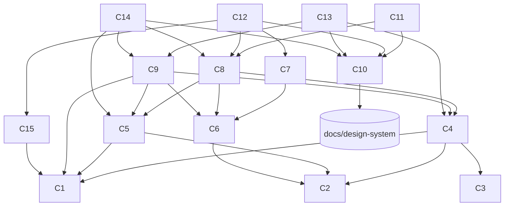

# Bookshelf — OpenSpec Capability Breakdown

_Дата: 2026-06-27_

Розбивка `docs/requirements.md` на **окремі capabilities**, кожна з яких
реалізується як **один OpenSpec change**. Тут — карта capability, граф залежностей
і **порядок виконання**. Самі специфікації — у `capabilities/<id>-<slug>.md` у
форматі OpenSpec (`### Requirement:` + `#### Scenario:` з `WHEN/THEN`).

## Як це лягає на OpenSpec

- Кожен файл у `capabilities/` — кандидат у **окрему OpenSpec-специфікацію**
  (capability). Коли почнемо реалізацію, на кожну заводимо OpenSpec change
  (пропозиція → дельта-спека → tasks → apply → archive).
- **Один capability за раз**, у порядку залежностей (нижче). Не починати change,
  доки не злиті всі його залежності — інакше дельта-спека спиратиметься на те,
  чого ще немає.
- Зв'язок із кодом і власниками — `docs/requirements.md` §5.5; зв'язок із TDD-кроками
  — `docs/superpowers/plans/2026-06-27-bookshelf.md`.

## Карта capabilities

| # | Capability | Change ID | Owner (§5.5) | Залежить від |
|---|-----------|-----------|--------------|--------------|
| C1 | Storage I/O | `add-storage-io` | `lib/content/fs-utils.ts`,`paths.ts` | — |
| C2 | Domain Model | `add-domain-model` | `lib/content/types.ts`,`colors.ts` | — |
| C3 | Slug | `add-slug` | `lib/content/slug.ts` | — |
| C4 | Book Store | `add-book-store` | `lib/content/books.ts` | C1, C2, C3 |
| C5 | Note Store | `add-note-store` | `lib/content/notes.ts` | C1, C2 |
| C6 | Links & Backlinks | `add-links-backlinks` | `lib/content/links.ts` | C2 |
| C7 | Markdown Render | `add-markdown-render` | `lib/markdown.ts` | C6 |
| C8 | Queries & Aggregation | `add-queries` | `lib/content/queries.ts`,`index-data.ts` | C4, C5, C6 |
| C9 | Server Actions (mutations) | `add-mutations` | `app/actions.ts` | C4, C5, C6, C1 |
| C10 | Design-System Integration | `add-design-system-integration` | `app/layout.tsx`,`components/ds/*` | `docs/design-system/` |
| C11 | Shelf / Index | `add-shelf-index` | `app/page.tsx`,`components/TagShelf` | C8, C10 |
| C12 | Book Page | `add-book-page` | `app/book/[slug]/page.tsx` | C8, C7, C10, C15 |
| C13 | Book Form | `add-book-form` | `app/book/new`,`[slug]/edit` | C9, C10, C4 |
| C14 | Note Editor | `add-note-editor` | `app/book/[slug]/notes/*` | C9, C10, C5, C8 |
| C15 | Cover Images | `add-cover-images` | `app/book/[slug]/[...cover]/route.ts` | C1 |

## Граф залежностей

## Порядок виконання

Граф ацикличний, тож порядок однозначний з точністю до паралельних гілок.

### Фазами (можна паралелити всередині фази)

- **Фаза 0 — Фундамент:** C1 Storage I/O · C2 Domain Model · C3 Slug.
  (C10 Design-System Integration теж можна почати тут — залежить лише від
  `docs/design-system/`, не від коду.)
- **Фаза 1 — Стори:** C4 Book Store · C5 Note Store.
- **Фаза 2 — Зв'язки/рендер:** C6 Links & Backlinks → C7 Markdown Render.
- **Фаза 3 — Агрегація:** C8 Queries & Aggregation.
- **Фаза 4 — Мутації/ассети:** C9 Server Actions · C15 Cover Images.
- **Фаза 5 — Екрани:** C11 Shelf · C12 Book Page · C13 Book Form · C14 Note Editor.

### Лінійно (один change за раз — рекомендовано)

1. `add-storage-io` (C1)
2. `add-domain-model` (C2)
3. `add-slug` (C3)
4. `add-book-store` (C4)
5. `add-note-store` (C5)
6. `add-links-backlinks` (C6)
7. `add-markdown-render` (C7)
8. `add-queries` (C8)
9. `add-design-system-integration` (C10)
10. `add-cover-images` (C15)
11. `add-mutations` (C9)
12. `add-shelf-index` (C11)
13. `add-book-page` (C12)
14. `add-book-form` (C13)
15. `add-note-editor` (C14)

**Critical path:** C1 → C4 → C8 → C12 (Book Page тягне найбільше залежностей).
Найраніший корисний демо-зріз: після C11 (полиця з книжками) видно застосунок.

## Статус

Це планувальний артефакт. **OpenSpec-проєкт ініціалізовано** (`openspec/`, CLI 1.4.1).
Перший change **`add-storage-io` (C1)** створено й валідовано (`openspec/changes/`).
Решта changes заводяться за порядком вище. Загальний стан — `docs/current-state.md`.
