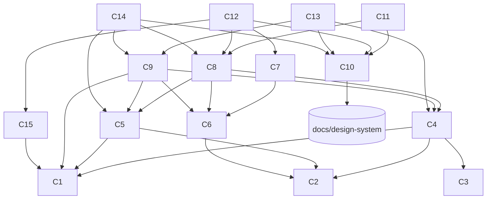

# Bookshelf — Requirements

_Дата: 2026-06-27 (оновлено з урахуванням `docs/design-system/`)_

Цей документ фіксує функціональні та нефункціональні вимоги, модель даних і
архітектуру. Базується на брейнштормі з власником і на згенерованій
дизайн-системі (`docs/design-system/` — **джерело істини для UI**).

## 1. Контекст і обмеження

| Параметр | Рішення |
|----------|---------|
| Користувачі | Один (власник), без авторизації |
| Пристрої | Один, локально |
| Стек | Next.js (App Router) + React + TypeScript |
| Сховище | Локальна файлова система |
| Формат | Markdown + YAML frontmatter |
| Редагування | Повністю всередині застосунку (UI пише `.md` файли) |
| Мова UI | **English**, sentence case (див. voice/tone у дизайн-системі) |
| UI-основа | Компоненти й токени з `docs/design-system/` (не з нуля) |

## 2. Модель даних

### 2.1 Структура на диску

Підхід **«тека на книжку»**: кожна нотатка — окремий файл, що дає стабільні ID
для посилань і беклінків.

```
content/
  books/
    <book-slug>/
      book.md            # метадані книжки + самарі
      cover.<ext>        # файл обкладинки (опц.)
      notes/
        <note-id>.md     # одна нотатка = один файл
        ...
```

### 2.2 `book.md` — frontmatter

```yaml
title: "Atomic Habits"        # обов'язкове
author: "James Clear"         # обов'язкове
cover: "cover.jpg"            # опц., відносний шлях у теці книжки
coverColor: "blue"           # опц., генерована обкладинка, якщо нема cover:
                              #   blue|coral|teal|purple|amber|green|ink
status: "finished"           # reading | finished | toread
dateRead: "2026-05-10"        # опц., ISO-дата (для finished)
rating: 9                     # опц., ціле 1–10
tags: ["philosophy", "re-read"]  # 0..N хештегів: lowercase, без пробілів
summary: "Short summary..."   # опц., текст
```

Body файлу `book.md` зарезервований під розширений самарі (markdown), якщо
`summary` у frontmatter замало.

### 2.3 Нотатка `<note-id>.md` — frontmatter + body

```yaml
id: "n-a1b2"                  # стабільний унікальний ID (генерується застосунком)
color: "yellow"              # HighlighterKey (8 кольорів, див. §2.4)
page: 88                      # опц., номер сторінки
excerpt: "The quoted passage" # опц., процитований уривок (фарбується кольором)
links:                        # 0..N вихідних посилань
  - "book:deep-work"          # на книжку (за slug)
  - "note:deep-work/n-x9y8"   # на конкретну нотатку (book-slug/note-id)
```

Body нотатки — **твоя рефлексія** у Markdown (поле `note` у `NoteCard`); може
містити wiki-посилання `[[...]]`, які рендеряться в навігацію.

### 2.4 Кольори нотаток (HighlighterKey)

**8 хайлайтерів дизайн-системи**, кожен із закріпленим значенням (значення
налаштовне, кольори фіксовані — їх дає `HighlighterPicker`):

| Колір | Значення | Колір | Значення |
|-------|----------|-------|----------|
| yellow | idea | purple | theme/motif |
| amber | question | blue | fact |
| coral | disagree | teal | term/vocab |
| pink | resonates | green | quote |

CSS-токени: `--hl-<color>` (насичений — спайн/крапка) і `--hl-<color>-mark`
(напівпрозорий маркер поверх тексту). `@default` = `yellow`.

## 3. Функціональні вимоги

### 3.1 Головна / індексна сторінка (`/`)
- Показує всі книжки, **згруповані за тегами** у «полиці» (shelves); книжка з
  кількома тегами з'являється під кожним своїм тегом.
- Кожна книжка — `BookCard` (обкладинка/генерована, назва, автор, оцінка 1–10,
  статус, лічильник нотаток).
- Клік по книжці веде на її сторінку.

### 3.2 Сторінка книжки (`/book/[slug]`)
- Метадані: обкладинка, назва, автор, статус, дата, оцінка (`Rating`), теги.
- Самарі (на reading-колонці, ширина `--reading-max`).
- Список нотаток (`NoteCard`): хайлайтер-спайн = колір, цитата (`excerpt`),
  рефлексія (body), сторінка, теги, лічильник посилань.
- Блок **"Linked from"** (беклінки) — хто посилається на цю книжку/нотатки.
- Вихідні посилання нотаток клікабельні й ведуть до цілі.

### 3.3 Створення / редагування
- Додати книжку: форма з усіма полями → застосунок створює теку й `book.md`.
  `book-slug` генерується авто-транслітерацією назви з можливістю ручної правки.
- Завантажити обкладинку → файл у теці книжки; або вибрати `coverColor`.
- Додати/редагувати/видалити нотатку: колір (`HighlighterPicker`), цитата,
  рефлексія, сторінка, посилання.
- **LinkPicker:** при додаванні посилання — вибір цільової книжки або нотатки
  зі списку наявних (звідси «посилання на вже існуючі»).
- Редагувати метадані книжки (оцінка, статус, теги, самарі).

### 3.4 Посилання та беклінки
- Підтримка двох типів посилань: `book:<slug>` та `note:<slug>/<note-id>`.
- Застосунок будує граф посилань скануванням усіх файлів і показує беклінки.
- Граф кешується в пам'яті, інвалідовується при будь-якому записі.

## 4. Нефункціональні вимоги

- **Мова UI — English**, sentence case; голос «начитаний друг», 2-га особа,
  без емодзі (деталі — `docs/design-system/readme.md`, розділ Content fundamentals).
- **Візуал з дизайн-системи:** токени `docs/design-system/tokens/*.css` +
  `styles.css`; шрифти Newsreader / Hanken Grotesk / Spline Sans Mono (числа —
  моно); підтримка темної теми (`data-theme="dark"`); іконки Lucide.
- **Цілісність даних:** усі дані лишаються читабельними `.md` файлами; застосунок
  не є єдиним способом їх прочитати.
- **Атомарний запис:** запис файлів через temp + rename, щоб уникати півфайлів.
- **Стійкість до помилок:**
  - Биті/неповні frontmatter → книжка показується з позначкою «потребує уваги»,
    не валить сторінку.
  - Посилання на неіснуючу ціль → рендериться як «розірване» посилання.
- **Ізоляція fs:** лише шар `lib/content` торкається файлової системи; UI працює
  з типізованими об'єктами.

## 5. Архітектура

### 5.1 Шари
- `lib/content/store` — CRUD над книжками й нотатками; I/O = типізовані об'єкти.
- `lib/content/links` — резолв `book:`/`note:` посилань, побудова беклінків.
- `lib/markdown` — рендер markdown + wiki-посилань у HTML.
- Server Actions / Route Handlers — єдина точка викликів `store` з UI.

### 5.2 Сторінки (App Router)
- `/` — індекс із групуванням за тегами (полиці).
- `/book/[slug]` — сторінка книжки.
- `/book/new`, `/book/[slug]/edit` — форма книжки.
- `/book/[slug]/notes/new`, `/book/[slug]/notes/[noteId]/edit` — редактор нотатки.

### 5.3 UI-компоненти
Будуються **поверх дизайн-системи** (`docs/design-system/components/`):
- `book/`: `BookCard`, `NoteCard`, `Rating`, `HighlighterPicker`.
- `core/`: `Button`, `IconButton`, `Input`, `Textarea`, `Select`, `Switch`, `Checkbox`.
- `display/`: `Card`, `Badge`, `Tag`, `Avatar`. `navigation/`: `Tabs`.
- Власні адаптери в `components/` — лише тонкі обгортки/композиції над ними
  (напр. `TagShelf`, `LinkPicker`, `BookForm`, `NoteForm`).
- Референс екранів: `docs/design-system/ui_kits/bookshelf/`.

### 5.4 Залежності (орієнтовно)
`gray-matter` (frontmatter), `remark`/`remark-html` (markdown). Шрифти й Lucide —
з CDN (як у дизайн-системі). Мінімум іншого.

### 5.5 Capabilities та залежності

Проєкт розбито на capabilities (самодостатні одиниці поведінки з чіткою межею).
Граф залежностей ацикличний; залежності лише «вниз» (UI → дані, не навпаки).
Лише шар даних і Server Actions торкаються `fs`.

| ID | Capability | Власник (модуль) | Залежить від |
|----|-----------|------------------|--------------|
| **C1** | Storage I/O — атомарний запис, читання, лістинг | `lib/content/fs-utils.ts`, `paths.ts` | — |
| **C2** | Domain Model — типи й кольори-хайлайтери | `lib/content/types.ts`, `colors.ts` | — |
| **C3** | Slug — транслітерація назви → slug | `lib/content/slug.ts` | — |
| **C4** | Book Store — CRUD книжок | `lib/content/books.ts` | C1, C2, C3 |
| **C5** | Note Store — CRUD нотаток | `lib/content/notes.ts` | C1, C2 |
| **C6** | Links & Backlinks — парсинг, граф, broken-links | `lib/content/links.ts` | C2 |
| **C7** | Markdown Render — markdown + wiki-`[[…]]` → HTML | `lib/markdown.ts` | C6 |
| **C8** | Queries & Aggregation — групування за тегами, цілі LinkPicker, індекс беклінків | `lib/content/queries.ts`, `index-data.ts` | C4, C5, C6 |
| **C9** | Server Actions — мутації з форм | `app/actions.ts` | C4, C5, C6, C1 |
| **C15** | Cover Upload/Serve — збереження й віддача обкладинок | `app/book/[slug]/[...cover]/route.ts`, `saveCover` | C1 |
| **C10** | Design-System Integration — токени, шрифти, Lucide, DS-компоненти | `app/globals.css`, `app/layout.tsx`, `components/ds/*` | `docs/design-system/` |
| **C11** | Shelf / Index — головна, полиці за тегами | `app/page.tsx`, `components/TagShelf` | C8, C10 |
| **C12** | Book Page — сторінка книжки, нотатки, беклінки | `app/book/[slug]/page.tsx`, `components/Backlinks` | C8, C7, C10, C15 |
| **C13** | Book Form — створення/редагування книжки | `app/book/new`, `[slug]/edit`, `components/BookForm` | C9, C10, C4 |
| **C14** | Note Editor — редактор нотатки, HighlighterPicker, LinkPicker | `app/book/[slug]/notes/*`, `components/NoteForm`, `LinkPicker` | C9, C10, C5, C8 |



**Порядок збірки (топологічний):** `C1, C2, C3` → `C4, C5` → `C6 → C7` → `C8`
→ `C9, C15` → `C10` (паралельно з даними) → `C11–C14`.
**Critical path:** C1 → C4 → C8 → C12.

### 5.6 Власність над вимогами (один власник на вимогу)

Кожну вимогу (§3–§4) реалізує **рівно один** capability; решту він лише *споживає*
через їх інтерфейс. Якщо вимога «тягнеться» у два власники — її розбито неправильно.

| Вимога | Власник |
|--------|---------|
| §3.1 Групування книжок за тегами у полиці | **C11** (агрегація — у C8) |
| §3.1 `BookCard` (обкладинка, оцінка, статус, лічильник) | **C11** (компонент — з C10) |
| §3.2 Метадані книжки на сторінці | **C12** |
| §3.2 Самарі (рендер markdown) | **C12** (рендер — через C7) |
| §3.2 Список нотаток (`NoteCard`) | **C12** (компонент — з C10) |
| §3.2 Блок «Linked from» (беклінки) | **C12** (індекс — з C8/C6) |
| §3.2 Клікабельні вихідні посилання нотаток | **C7** |
| §3.3 Створити/редагувати книжку, slug із правкою | **C13** (запис — C9; slug — C3) |
| §3.3 Обкладинка / `coverColor` | **C15** |
| §3.3 Створити/редагувати/видалити нотатку | **C14** (запис — C9) |
| §3.3 LinkPicker (наявні цілі) | **C14** (цілі — з C8) |
| §3.4 Парсинг посилань `book:`/`note:` | **C6** |
| §3.4 Граф беклінків + кеш | **C6** (завантаження з диска — C8) |
| §4 Мова/voice UI = English | **C10** + кожен UI-capability у власних текстах |
| §4 Візуал (токени/шрифти/іконки) | **C10** |
| §4 Цілісність даних (читабельні `.md`) | **C4** (книжки) + **C5** (нотатки), кожна у своєму форматі |
| §4 Атомарний запис | **C1** |
| §4 Биті frontmatter → `malformed` | **C4** |
| §4 Розірване посилання → broken | **C6** (`isBrokenLink`); відображення — C12 |
| §4 Ізоляція fs | **C1** |

## 6. Тестування
- Unit на `store` та `links` із тимчасовою текою як фікстурою (TDD).
- Unit на чистих функціях рендеру markdown/wiki-посилань.
- Component-тести на адаптери (рендер, прокидання пропсів у DS-компоненти).

## 7. Рішення (закриті питання)
1. **Кольори нотаток:** 8 хайлайтерів із закріпленими значеннями (§2.4).
2. **Структура нотатки:** багатша — `excerpt` + рефлексія (body) + `page` + color + links.
3. **Мова UI:** English (узгоджено з дизайн-системою).
4. **Статус книжки:** `reading | finished | toread` (назви з дизайн-системи).
5. **`book-slug`:** авто-транслітерація з можливістю ручної правки.
6. **Пошук/фільтр на індексі:** поза скоупом першого релізу.

## 8. Дизайн-система (`docs/design-system/`)

Згенерована в claude.ai/design (проєкт `Bookshelf Design System`,
`18192e51-5d02-4b2e-b59e-b966fbef3af1`). Витягнута локально як **джерело істини
для UI**: токени, компоненти (`.jsx` + `.d.ts` + `.prompt.md`), гайдлайни
(`guidelines/foundations/*`), готові екрани (`ui_kits/bookshelf/`).

- Перед стилізацією/UI-роботою читати `readme.md`, `styles.css`, потрібні
  `tokens/*.css` і `.prompt.md` відповідних компонентів.
- Не реалізовувати UI з нуля там, де є готовий компонент DS.
- Скомпільований `_ds_bundle.js` локально не зберігаємо — лише джерело.
