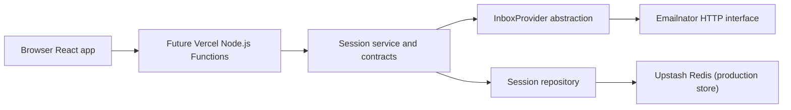

# Email Shadow Panel Architecture

## Status

Accepted for local production-core implementation after Phase 0 feasibility

## System Context

Email Shadow Panel uses the existing browser frontend, future Vercel Node.js Functions, shared server-domain contracts, an isolated Emailnator provider adapter, an anonymous session service, and temporary persistence. Emailnator remains an undocumented and untrusted upstream dependency.



## Component Boundaries

- React frontend: renders the existing UI, stores local recent-session references later, and never handles provider cookies, XSRF values, provider message IDs, or encrypted provider state.
- Route handlers: remain a later thin transport layer that validates inputs, maps HTTP concerns, and delegates to the session service.
- Shared server-domain contracts: define runtime-validated anonymous-session records, service outputs, message references, and error codes.
- Inbox provider abstraction: defines create, list, and detail operations that return refreshed provider state without leaking provider internals to transport consumers.
- Emailnator provider implementation: owns bootstrap, cookie handling, XSRF handling, bounded Gmail-style generation fallback, response validation, timeouts, and provider-error normalization.
- Anonymous session service: coordinates visitor hashing, capability-token issuance, provider-state encryption, repository persistence, and safe application message references.
- Session repository: stores only hashed capability identifiers, hashed visitor identifiers, encrypted internal session state, timestamps, provider identifier, and optimistic-concurrency version.
- Rate limiting and abuse controls: remain later transport-layer concerns.
- Message sanitization and display rendering: remain later presentation-layer concerns.

## Repository Boundaries

```text
api/
server/
  providers/
  session/
scripts/
src/
tests/
docs/
```

The frontend remains unchanged in Phase 1.

## Anonymous Session Model

A persisted anonymous session contains:

- internal session ID
- capability-token hash
- anonymous visitor hash
- generated inbox address
- encrypted internal session state
- provider-state version
- provider identifier
- created timestamp
- updated timestamp
- expiration timestamp
- schema version

The encrypted internal session state contains:

- Emailnator provider state
- bounded application message-reference mappings

Plaintext capability tokens, raw visitor identifiers, provider cookies, XSRF values, and provider message IDs are not persisted in plaintext session records.

## Message Reference Strategy

Provider message IDs stay internal to the provider and encrypted session state.

The session service issues opaque application message references that:

- are generated randomly;
- are reused for repeated appearances of the same provider message;
- are stored only inside encrypted state;
- are bounded and pruned deterministically;
- fail safely when stale or unknown.

## Persistence Strategy

Two repository implementations exist in Phase 1:

- deterministic in-memory repository for tests;
- production Upstash Redis repository for later deployment use.

Both repositories support:

- create with TTL;
- find by capability-token hash;
- delete by capability-token hash;
- count active sessions by visitor hash;
- atomic compare-and-set encrypted-state updates that preserve expiration.

The Redis implementation uses namespaced keys and a Lua-script compare-and-set update so concurrent refreshes cannot silently overwrite newer state.

## Request Flows

- Session creation: the future API layer supplies an opaque visitor identifier; the session service hashes it, generates a capability token, asks the provider to create an inbox, encrypts internal session state, persists the session, and returns the plaintext capability token once with safe inbox metadata.
- Message listing: the session service validates and hashes the capability token, decrypts state, lists provider messages, resolves or creates safe message references, re-encrypts refreshed state, and persists it through compare-and-set.
- Message detail: the session service validates the capability token, resolves the safe message reference to a provider message ID inside encrypted state, fetches detail, re-encrypts refreshed state, and persists it atomically.
- Session deletion: the future API layer requests deletion by capability token; the repository removes temporary application state only.

## Security Boundaries

Emailnator is untrusted, message content is untrusted, and temporary persistence is treated as sensitive infrastructure.

The server therefore:

- uses a fixed Emailnator origin;
- encrypts internal session state before persistence;
- stores only capability hashes and visitor hashes in plaintext persistence fields;
- keeps provider state and message-ID mappings out of browser-facing results;
- normalizes provider, persistence, configuration, and encryption failures into transport-independent domain errors;
- does not expose arbitrary upstream URLs or headers.

## Deployment Topology

The active target remains Vercel Hobby with Node.js Functions. Upstash Redis Free remains the intended production backing store for temporary encrypted anonymous sessions once later phases add HTTP integration and deployment verification.

## Failure Modes

- provider unavailable
- provider challenge or rate limit
- provider response incompatibility
- capability token invalid
- session expired or missing
- stale concurrent session update
- persistence unavailable
- encryption failure
- configuration invalid
- timeout

## Architectural Gates

- Phase 0 established the accepted direct HTTP Emailnator path.
- Phase 1 establishes the local production-core backend services.
- Phase 2 will add transport and API integration.
- Phase 4 will handle deferred deployment and live infrastructure validation.

## Deferred Decisions

- exact HTTP route contracts and status-code mapping
- abuse-control policy and active-session limits
- frontend integration details for local recent-session references
- deployment-environment validation for Upstash and Vercel
- later sanitization and OTP extraction presentation flows
