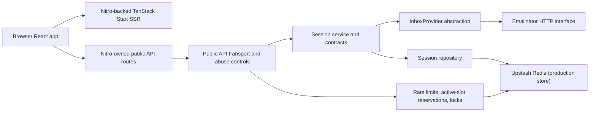

# Email Shadow Panel Architecture

## Status

Accepted baseline with Phase 3 frontend integration implemented locally

## System Context

Email Shadow Panel uses the existing browser frontend, Nitro-owned public API routes under `routes/api/*`, a Nitro-backed TanStack Start SSR runtime, shared server-domain contracts, an isolated Emailnator provider adapter, an anonymous session service, a public HTTP transport layer with abuse controls, and temporary persistence. Emailnator remains an undocumented and untrusted upstream dependency.



## Component Boundaries

- React frontend: renders the existing UI through a browser-only API client, a focused inbox controller, and versioned local recent-inbox storage; it never handles provider cookies, XSRF values, capability hashes, provider message IDs, or encrypted provider state.
- Route handlers: live as Nitro server routes under `routes/api/*`, stay thin, validate HTTP concerns, enforce same-origin checks for state changes, and delegate to the public API handler composition root.
- Public API transport: owns bearer extraction, visitor-cookie handling, trusted client-IP hashing, public response contracts, error mapping, rate limits, active-slot reservations, per-session locks, request deadlines, and the provider kill switch.
- Shared server-domain contracts: define runtime-validated anonymous-session records, safe message references, public API envelopes, and stable error codes.
- Inbox provider abstraction: defines create, list, and detail operations with optional abort signals and no transport knowledge.
- Emailnator provider implementation: owns bootstrap, cookie handling, XSRF handling, bounded Gmail-style generation fallback, response validation, timeouts, response-size bounds, and provider-error normalization.
- Anonymous session service: coordinates visitor hashing, capability-token issuance, provider-state encryption, repository persistence, and safe application message references.
- Session repository: stores only hashed capability identifiers, hashed visitor identifiers, encrypted internal session state, timestamps, provider identifier, optimistic-concurrency version, and active-session reservation state required for concurrency-safe limits.
- Message sanitization and display rendering: remain presentation concerns; message content remains untrusted when returned by the API.

## Repository Boundaries

```text
routes/
  api/
src/
  routes/
server/
  api/
  providers/
  session/
scripts/
tests/
docs/
```

The frontend is connected to the public API in Phase 3 through one typed same-origin client, a controller that centralizes polling and cancellation, and bounded browser-local recent-inbox persistence.

## Anonymous Session Model

A persisted anonymous session contains:

- internal session ID
- capability-token hash
- anonymous visitor hash
- generated inbox address
- encrypted internal session state
- provider-state version
- provider identifier
- created timestamp
- updated timestamp
- expiration timestamp
- schema version

The encrypted internal session state contains:

- Emailnator provider state
- bounded application message-reference mappings

Plaintext capability tokens, raw visitor identifiers, raw client IP addresses, provider cookies, XSRF values, and provider message IDs are not persisted in plaintext session records.

## Message Reference Strategy

Provider message IDs stay internal to the provider and encrypted session state.

The session service issues opaque application message references that:

- are generated randomly;
- are reused for repeated appearances of the same provider message;
- are stored only inside encrypted state;
- are bounded and pruned deterministically;
- fail safely when stale or unknown.

## Persistence and Abuse-Control Strategy

Two repository implementations exist:

- deterministic in-memory persistence for tests;
- production-shaped Upstash Redis persistence for later deployment use.

Both repositories support:

- create with TTL;
- lookup by capability-token hash;
- delete by capability-token hash;
- count active sessions by visitor hash;
- atomic compare-and-set encrypted-state updates that preserve expiration;
- active-session slot reservations used by the Phase 2 active-inbox limiter.

The transport layer adds:

- fixed-window rate limits per visitor hash, client-IP hash, and capability hash;
- atomic active-inbox reservations before provider creation;
- per-capability operation locks for list and detail;
- one API-level request deadline for provider-touching operations.

The Redis implementation uses namespaced keys, Lua scripts, and `SET NX PX` lock acquisition so concurrent creates and concurrent refreshes remain safe without storing plaintext visitor or capability values.

## Request Flows

- Session creation: the public API layer validates the request, enforces same-origin policy, rotates or reuses the anonymous visitor cookie, hashes visitor and client-IP values, enforces visitor and client-IP create limits, reserves one visitor inbox slot atomically, calls the session service with an abort signal, releases the reservation, and returns the capability token once with safe inbox metadata.
- Message listing: the public API layer validates the bearer capability, enforces capability read limits, acquires a per-capability lock, calls the session service with a deadline signal, persists refreshed encrypted state atomically, releases the lock, and returns provider-neutral message summaries with application message references.
- Message detail: the public API layer validates the bearer capability and message reference, enforces capability read limits, acquires the same per-capability lock, fetches detail through the session service with a deadline signal, releases the lock, and returns provider-neutral detail data.
- Session deletion: the public API layer validates the bearer capability and deletes temporary application state only. Delete remains available even when the provider kill switch is active.
- Health: the public API layer returns only `ok` or `degraded`, does not call Emailnator, and does not perform Redis writes.

## Security Boundaries

Emailnator is untrusted, message content is untrusted, and temporary persistence is treated as sensitive infrastructure.

The server therefore:

- uses a fixed Emailnator origin;
- encrypts internal session state before persistence;
- stores only capability hashes and visitor hashes in plaintext persistence fields;
- hashes client-IP values immediately at the transport boundary and never persists or logs the raw value;
- accepts bearer capabilities only through the `Authorization` header;
- applies no-store and nosniff response headers to the public API;
- keeps provider state and message-ID mappings out of browser-facing results;
- normalizes provider, persistence, configuration, and timeout failures into stable public envelopes;
- blocks create, list, and detail requests through a provider kill switch when configured.

## Deployment Topology

The active target remains Vercel Hobby with Nitro-owned public API routes plus a Nitro-generated SSR runtime for the TanStack Start root application. Upstash Redis Free remains the intended production backing store for temporary encrypted anonymous sessions, rate limits, active-slot reservations, and operation locks once later phases validate deployment behavior.

## Failure Modes

- malformed request
- invalid or missing capability token
- unknown session
- expired session
- unknown message reference
- provider kill switch enabled
- active-inbox limit reached
- rate limit reached
- operation already in progress
- provider unavailable or challenged
- provider response incompatibility
- persistence unavailable
- encryption failure
- configuration invalid
- timeout

## Architectural Gates

- Phase 0 established the accepted direct HTTP Emailnator path.
- Phase 1 established the local production-core backend services.
- Phase 2 establishes the local public HTTP transport and abuse controls.
- Phase 4 remains the deployment and live-infrastructure validation gate.

## Deferred Decisions

- live browser verification against Emailnator through the public API;
- deployed forwarded-header validation in Vercel Preview and Production;
- live Upstash-backed persistence and deployed Emailnator verification through the public API;
- later sanitization and OTP extraction presentation flows beyond the current provider-neutral detail payload.
