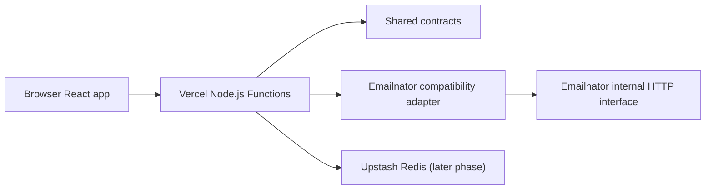

# Email Shadow Panel Architecture

## Status

Provisional pending Phase 0 feasibility

## System Context

Email Shadow Panel uses the existing browser frontend, Vercel Node.js Functions, an isolated Emailnator compatibility adapter, and provisional later-phase Upstash Redis state. Emailnator's internal HTTP interface is undocumented and untrusted.



## Component Boundaries

- React frontend: renders the existing UI, stores local recent-session references, requests inbox operations, and never handles provider-specific internals.
- API handlers: validate application requests, authorize capability tokens, call server services, and remain thin.
- Shared contracts: define runtime-validated request and response shapes used across frontend and server boundaries.
- Emailnator adapter: owns provider bootstrap, cookies, XSRF handling, generation, list, detail, response validation, timeouts, and provider error mapping.
- Temporary session repository: later stores encrypted provider state, token hashes, TTLs, refresh locks, and limits.
- Rate limiting: applies visitor and network controls before provider calls.
- Capability authorization: protects inbox access without product-user accounts.
- Message sanitization: later converts untrusted provider message content into safe display content.

## Planned Repository Boundaries

```text
api/
server/
  providers/emailnator/
shared/
src/
tests/
docs/
```

No source files are moved during Phase 0A.

## Request Flows

- Inbox generation: browser requests generation; API validates limits; adapter creates provider session and address; server stores temporary encrypted state in a later phase; browser stores a local reference.
- Message-list refresh: browser refreshes the selected inbox; API validates capability and refresh interval; adapter fetches and validates the list.
- Individual-message retrieval: browser requests one message; API validates capability; adapter fetches and validates detail; message content is sanitized before display in later phases.
- Session removal: browser removes the local reference and asks the server to delete Email Shadow Panel temporary state only; no provider-side deletion claim is made.

## Session Model

The browser may hold a random visitor ID and local inbox references. Each inbox uses a capability token in later phases. Provider state is encrypted before Redis persistence and expires by TTL. Browser-storage loss means session-access loss. There is no cross-device recovery.

## Polling Model

Only the current inbox is polled. Polling adapts to visible tabs, pauses or sharply reduces work in hidden tabs, supports Manual Refresh, respects a server-side minimum refresh interval, and backs off on errors.

## Security Boundaries

Emailnator is an untrusted, undocumented dependency. Email contents are untrusted input. The server uses a fixed provider origin, does not proxy arbitrary URLs or headers, encrypts temporary provider state, hashes capability tokens, and emits sanitized logs only.

## Deployment Topology

The active target is Vercel Hobby with Node.js Functions. Upstash Redis Free is a provisional later-phase store for temporary encrypted state, capability hashes, limits, and refresh locks. Oracle infrastructure and browser workers are not part of the active architecture.

## Failure Modes

- Provider unavailable.
- Provider contract changed.
- Provider blocks Vercel.
- Cookie or XSRF rotation.
- Application session expiration.
- Upstash unavailable in later phases.
- Rate limit reached.
- Invalid provider response.
- Message detail unavailable.

## Architectural Gates

Phase 0 must return GO before the HTTP adapter architecture is accepted for production implementation.

## Deferred Decisions

- Exact Emailnator request sequence and response schemas.
- Whether Vercel Preview can reach the provider reliably.
- Whether provider session state can be serialized and restored safely.
- Redis key structure, TTL values, and refresh-lock policy.
- Final polling intervals and active-inbox limits.
